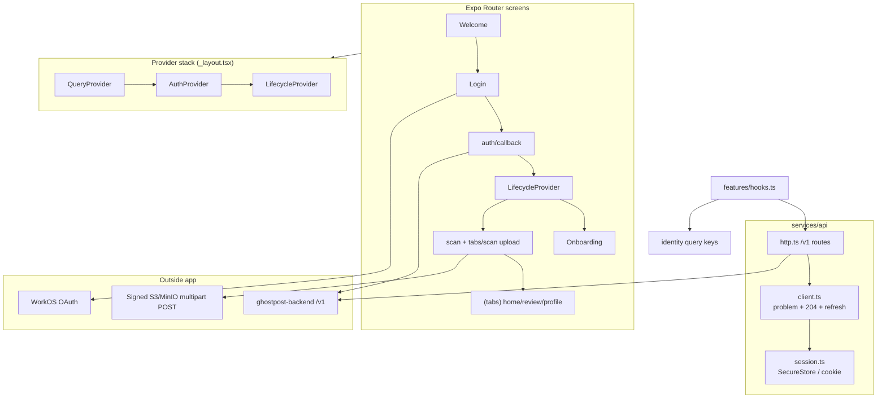
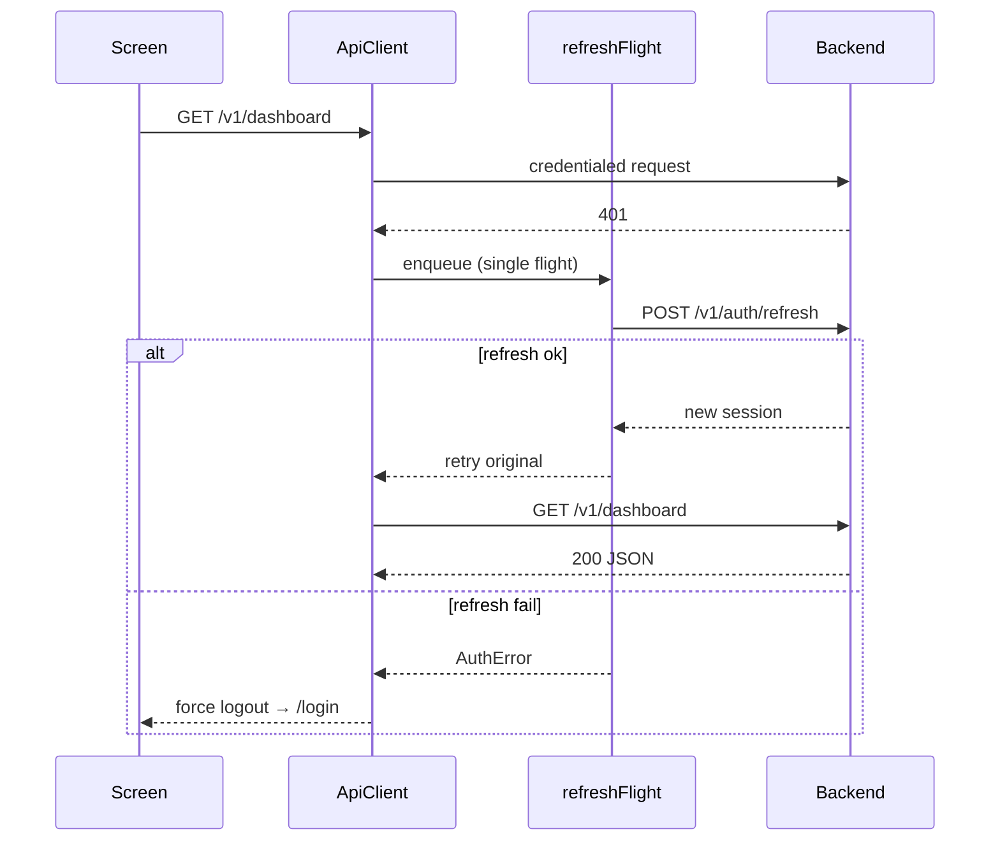

# Plan 007: Expo production cutover — auth, transport, lifecycle, archive upload, legacy purge
> **Executor instructions**: Follow this plan step by step. Run every
> verification command and confirm the expected result before moving to the
> next step. If anything in the "STOP conditions" section occurs, stop and
> report — do not improvise. When done, update the status row for this plan
> in `plans/README.md` — unless a reviewer dispatched you and told you they
> maintain the index.
>
> **Drift check (run first)**: `git diff --stat 3625ed1..HEAD -- app/package.json app/package-lock.json app/app.json app/README.md app/src`
> If any in-scope file changed since this plan was written, compare the
> "Current state" excerpts against the live code before proceeding; on a
> mismatch, treat it as a STOP condition.
>
> **Canonical inputs**: Honor contracts from Plans 001, 003, 004, and 006;
> use the FrontendCutover agent brief (`'/Users/peter/.omp/agent/sessions/-Code-ghostpost/2026-07-23T07-10-39-920Z_019f8dcf-e52f-7000-9275-dcdd40349fb1/FrontendCutover.md'`) and review
> artifacts (DesignIntegrator, SecurityReview, ProductFlowReview) cited in
> Plan 008. Do not invent parallel auth, upload, or entitlement APIs.
## Status
- **Priority**: P0
- **Effort**: L
- **Risk**: HIGH
- **Depends on**: plans/001-recover-typescript-baseline.md, plans/003-workos-auth-profiles-onboarding.md, plans/004-archive-upload-ingestion.md, plans/006-product-apis-entitlements.md
- **Category**: migration
- **Planned at**: commit `3625ed1`, 2026-07-23
## Why this matters
At `3625ed1` the Expo app is a polished UI scaffold on mock data and device-local
gate booleans. `createApi()` silently selects `mockApi` when `EXPO_PUBLIC_API_URL`
is unset; `AppStateProvider` persists `hasStarted`, `onboardingComplete`,
`scanComplete`, and `homeUnlocked` in AsyncStorage; the locked screen sells priced
plans and calls `/home/unlock`; profile exposes `resetDemo` and mock onboarding
snapshots. None of that can ship.
Plans 003, 004, and 006 define the real backend: WorkOS-backed sessions with
web/native CSRF and exchange binding, direct signed archive POST policies with
immutable version pinning, and server-issued `free_beta` entitlement (no client
unlock routes, no priced checkout).
Plan 001 must be green first so this cutover does not mix
hundreds of pre-existing TS errors with product rewrites.
This plan is the **single atomic frontend cutover**: wire auth and callback,
replace transport, drive navigation from server lifecycle, upload ZIPs directly
via `expo/fetch`, poll import/scan IDs honestly, remove every mock/demo/fallback
path, and leave only production copy. After this plan, missing API URL is a hard
startup failure and grep proves mocks are gone.
## Current state
### Relevant files (plan-time `3625ed1`)
| Path | Role today | Cutover action |
|------|------------|----------------|
| `app/src/services/api/index.ts` | Mock when no `EXPO_PUBLIC_API_URL` | Require URL; delete mock branch |
| `app/src/services/api/http.ts` | Uncredentialed JSON `fetch`; legacy paths | Replace with `/v1` client + auth/CSRF |
| `app/src/services/api/mock.ts` | In-memory demo API + `GhostpostApi` | Split types to `api/types.ts`; delete mock |
| `app/src/mocks/fixtures.ts` | `MOCK_USER`, posts, onboarding defaults | **Delete** |
| `app/src/providers/app-state.tsx` | AsyncStorage gate booleans | **Delete**; server lifecycle |
| `app/src/providers/query-provider.tsx` | TanStack persist to AsyncStorage | In-memory only |
| `app/src/features/query-keys.ts` | Static keys | Identity-scoped in-memory keys |
| `app/src/features/hooks.ts` | Mock unlock/reset/scan | Real mutations; drop reset/unlock |
| `app/src/domain/pricing.ts` | `$9.99`–`$24.99` plans | **Delete** (free beta) |
| `app/src/app/_layout.tsx` | `AppStateProvider` + local `gate` guards | `AuthProvider` + lifecycle guards |
| `app/src/app/login.tsx` | Demo-user bypass | Real OAuth start |
| `app/src/app/locked.tsx` | Priced plan picker + `/home/unlock` | **Delete route**; `free_beta` never reaches locked |
| `app/src/app/scan.tsx` | Polls `/scan` mock phases | Poll import/scan job IDs |
| `app/src/app/(tabs)/scan.tsx` | "Start new mock scan" | ZIP picker + signed multipart POST |
| `app/src/app/(tabs)/profile.tsx` | Mock snapshot + reset demo | Logout, deletion, honest copy |
| `app/package.json` | Persist packages; no picker | Add picker; remove persist deps |
| `app/app.json` | Scheme `ghostpost`; static web | Auth callback routes / intent |
| `app/README.md` | Documents mock-by-default | Production-only docs |
### Observed adapter selection (`app/src/services/api/index.ts`)
```ts
export function createApi(): GhostpostApi {
  if (process.env.EXPO_PUBLIC_API_URL) {
    return httpApi;
  }
  return mockApi;
}
export const api = createApi();
```
### Observed HTTP transport (`app/src/services/api/http.ts`)
```ts
async function request<T>(path: string, init?: RequestInit): Promise<T> {
  const response = await fetch(`${base}${path}`, {
    ...init,
    headers: { 'Content-Type': 'application/json', ...(init?.headers ?? {}) },
  });
  if (!response.ok) {
    const message = await response.text();
    throw new Error(message || `Request failed: ${response.status}`);
  }
  return response.json() as Promise<T>;
}
```
Legacy routes: `/me`, `/dashboard`, `/review`, `/posts/{id}`, `/onboarding`,
`/scan`, `/home/unlock`, `/demo/reset`. No auth headers, no RFC7807, no 204
handling, no direct object-store upload.
### Observed local gate (`app/src/providers/app-state.tsx`)
```ts
function deriveGate(state): AppGate {
  if (!state.hasStarted) return 'welcome';
  if (!state.onboardingComplete) return 'onboarding';
  if (!state.scanComplete) return 'scan';
  if (!state.homeUnlocked) return 'locked';
  return 'app';
}
```
Persisted under AsyncStorage key `ghostpost-app-state`. Product flow is entirely
client-owned.
### Observed dishonest UI
- `login.tsx`: "Continue as demo user" skips to paywall.
- `locked.tsx`: `PRICING_PLANS`, `Continue · $14.99`, calls `unlockHome()`.
- `profile.tsx`: imports `getMockOnboardingSnapshot`, "reset demo →".
- `(tabs)/scan.tsx`: "mock scan service".
- `platforms.tsx`: disclaimer present but no recorded consent artifact.
### Backend contracts this plan consumes (Plans 003 / 004 / 006 — do not re-specify)
**Plan 003 — Auth & profiles**
- `GET /v1/auth/authorize?client=web|native` — **no** `redirect_uri` query param; server picks allowlisted frontend redirect URI from env; **both** clients receive `200` JSON `{ authorizationUrl, state, expiresAt }` (native adds `exchangeSecret`) (**no** `POST /v1/auth/authorize`).
- **Web**: authorize response sets HttpOnly pre-auth cookie `gp_auth_init` (client-bound exchange proof for `POST /v1/auth/exchange`); JSON does **not** include `exchangeSecret`.
- **Native**: authorize JSON **includes** server-issued one-time `exchangeSecret`; client persists it until exchange completes and presents it once at `POST /v1/auth/exchange` — **never** generate `exchangeSecret` client-side.
- WorkOS redirects to **frontend-only** callbacks (`/auth/callback`, `ghostpost://auth/callback?code&state`); callback screen forwards to backend `POST /v1/auth/exchange` (**no** backend OAuth callback route — **no** `POST /v1/auth/callback`, **no** `GET /v1/auth/callback`).
- Exchange bodies **always** include `client`: web `{ client: 'web', code, state }` (the HttpOnly pre-auth cookie is the only exchange proof); native `{ client: 'native', code, state, exchangeSecret }` (`exchangeSecret` comes from authorize JSON).
- **Exchange responses (explicit DTOs — never store WorkOS tokens)**:
  - **Web**: `POST /v1/auth/exchange` → **`204 No Content`** + HttpOnly `gp_session` cookie (session lives in cookie transport only).
  - **Native**: `POST /v1/auth/exchange` → **`200` JSON** `{ user, session: { kind: 'bearer', token, expiresAt } }` — persist `session.token` in SecureStore for bearer transport; **all native callsites use `session.token`**; **never** persist WorkOS access/refresh/id tokens or any other token field names.
- `POST /v1/auth/logout` (`204`), `POST /v1/auth/refresh` (single-use rotation), `GET /v1/auth/csrf` (web mutations require `X-CSRF-Token` + exact `Origin`).
- `GET /v1/me` → profile projection only (auth/session bootstrap; **no** embedded `lifecycle` field; **no** `/v1/lifecycle` endpoint).
- `GET /v1/me/onboarding`, `PUT /v1/me/onboarding` → revisioned **`OnboardingState`** snapshot `{ status, currentStep, revision, answers }` (web CSRF on PUT); **PUT the full snapshot** each step (optimistic concurrency via `revision`); responses are onboarding DTOs only — **no** lifecycle/gate projection and **no** `completed` boolean.
- `GET /v1/platforms` → platform + onboarding option catalog (**not** `/v1/platforms/catalog`).
- `DELETE /v1/me` → `202` deletion scheduled (UI must be honest about async purge; **not** `DELETE /v1/account`).
**Plan 004 — Archive upload & ingestion**
- `POST /v1/archive-imports` with reserve DTO `{ platform, contentLength, contentType }` → `{ id, upload: { method: 'POST', url, fields }, expiresAt }` (client sends metadata only; **no** client-side SHA/base64 hashing).
- Client appends signed fields plus the native `File` to `FormData` and POSTs **directly** to object storage via `expo/fetch` (never through API body; never base64).
- `POST /v1/archive-imports/{id}/complete` → HEAD-verify + pin immutable version (**no** request body; server trusts object store HEAD only — client must not resend size/hash metadata).
- `GET /v1/archive-imports/{id}` → import status until `ready` or terminal failure.
**Plan 006 — Product APIs & free_beta entitlement**
- `POST /v1/scans` with body **`{ archiveImportIds: string[] }`** listing **exact ready** archive-import ids (from terminal `ready` imports only) → **`202`** + scan id; preserve returned **scan id** in route/query and honor server idempotency (retry with same ids must not spawn duplicate scans). `GET /v1/scans/current`, `GET /v1/scans/{id}` — poll **`status`** until terminal (`succeeded`, `failed`, or `cancelled`); only `succeeded` may project `phase=complete`.
- `GET /v1/dashboard`, `GET /v1/flags`, `GET /v1/flags/{id}`, `POST /v1/flags/{id}/review-actions` (UI “delete” → `delete_local`).
- `GET /v1/me/entitlement` → `{ productId: 'free_beta', capabilities: { reviewAccess: true, … } }` (read-only; server-issued).
- **Forbidden client routes**: `/home/unlock`, `/demo/reset`, `/v1/posts/**`, `/v1/review`, `/v1/entitlement`, `/v1/lifecycle`, `/v1/onboarding`, `/v1/platforms/catalog`, `POST /v1/auth/authorize`, `POST /v1/auth/callback`, `DELETE /v1/account`, `/v1/source-accounts/**`, `POST /v1/scans/{id}/cancel`, `/v1/billing/**`, grant/unlock/demo endpoints.
- **`free_beta`**: remove/hide all priced CTAs; never call client unlock; no `locked` gate/route at launch; when `capabilities.reviewAccess=true`, route straight to `app`.
**Lifecycle routing (client-derived from authoritative reads — no `/v1/lifecycle`, no embedded `me.lifecycle`)**
Derive the Expo Router gate from server reads only (never from a single lifecycle endpoint or embedded profile field):
| Input | Source |
|-------|--------|
| Authenticated? | session bootstrap + `GET /v1/me` |
| Onboarding incomplete? | `GET /v1/me/onboarding` → `OnboardingState.status !== 'complete'` (use `currentStep` + `revision`; **never** a `completed` boolean) |
| Archives not ready? | **`GET /v1/archive-imports`** on reopen/bootstrap (server-owned list — in-memory map alone cannot recover ids after app kill) + `GET /v1/archive-imports/{id}` poll each known id until `ready` or terminal failure |
| Scan in flight? | `GET /v1/scans/current` or `GET /v1/scans/{id}` with non-terminal **`status`** |
| Review access? | `GET /v1/me/entitlement` (`capabilities.reviewAccess`) + terminal scan `status=succeeded` |
Client gate enum for launch **`free_beta`**: `welcome | onboarding | awaiting_import | scanning | app` — **no `locked` gate** (no priced/paywall UI at launch).
| Derived `gate` | Route guard | Notes |
|----------------|-------------|-------|
| `welcome` | `/welcome`, `/login` | unauthenticated or pre-bootstrap |
| `onboarding` | `/onboarding/*` | `OnboardingState.status !== 'complete'` |
| `awaiting_import` | `/(tabs)/scan` or onboarding imports | selected platforms lack `ready` archive import |
| `scanning` | `/scan` | non-terminal scan **`status`** |
| `app` | `/(tabs)`, `/review/*` | terminal scan `succeeded` + `reviewAccess: true` (always for launch `free_beta`) |
Do not register a `locked` route or gate at launch — entitlement without review access shows honest support/retry copy, not priced checkout.
### Architecture (target)

### Session & refresh (single-flight)

## Commands you will need
| Purpose | Command | Expected on success |
|---------|---------|---------------------|
| Plan 001 gate | `cd app && npm run typecheck` | exit 0 (STOP if red) |
| Drift check | `git diff --stat 3625ed1..HEAD -- app/` | review only |
| Install (SDK-safe) | `cd app && npm ci && npx expo install expo-document-picker expo-web-browser expo-file-system expo-crypto` | exit 0; lockfile updated |
| Remove persist deps | `cd app && npm uninstall @tanstack/query-async-storage-persister @tanstack/react-query-persist-client` | exit 0 |
| Lint (informational) | `cd app && npm run lint` | exit 0 or documented pre-existing |
| Typecheck | `cd app && npm run typecheck` | exit 0 |
| Web export | `cd app && EXPO_PUBLIC_API_URL=http://localhost:8080 npm run export:web` | exit 0; URL inlined; same-site with local web callback |
| Mock purge grep | see Done criteria | zero forbidden matches |
| Local E2E (web) | Compose up + export web + manual auth | full lifecycle |
| Local E2E (native) | `EXPO_PUBLIC_API_URL=http://10.0.2.2:8080 npx expo start --android` | auth + upload |
| Missing API failure | unset env + import api module | throws at init |
All commands use cwd `app/` unless noted. Do **not** run repo-wide formatters as gates.
## Suggested executor toolkit
- Plans 003–006 backend running locally (Plan 008 Compose) or documented staging URL.
- npm in `app/` (`package-lock.json` authority).
- `npx expo install` for any new Expo module — never hand-pin SDK 57 peers.
- WorkOS test org credentials in backend `.env` only — never `EXPO_PUBLIC_*` secrets.
- FrontendCutover checklist: treat SecurityReview CSRF/cookie rules and
  ProductFlowReview honest-copy requirements as hard gates.
## Scope
**In scope** — exact file map (create / modify / delete):
### Create
| File | Purpose |
|------|---------|
| `app/src/providers/auth-provider.tsx` | Session context, login/logout, refresh registration |
| `app/src/providers/lifecycle-provider.tsx` | Client-derived gate from onboarding/imports/scans/entitlement + redirects |
| `app/src/app/auth/callback.tsx` | Web OAuth return + native deep-link handler |
| `app/src/app/auth/callback.native.tsx` | Optional platform split if web needs DOM |
| `app/src/services/api/client.ts` | Credentialed fetch, CSRF, problem+json, 204, refresh |
| `app/src/services/api/session.ts` | SecureStore `session.token` (native) / cookie (web) accessors |
| `app/src/services/api/problem.ts` | Parse `application/problem+json` → typed errors |
| `app/src/services/api/types.ts` | `GhostpostApi` + wire DTOs (extracted from mock) |
| `app/src/services/api/archive-upload.ts` | Signed fields → `FormData` + File POST → complete |
| `app/src/services/api/lifecycle.ts` | Derive route gate + `GET /v1/archive-imports` bootstrap for reopen recovery |
| `app/src/features/auth-hooks.ts` | `useSession`, `useLogout`, `useDeleteAccount` |
| `app/src/features/lifecycle-hooks.ts` | `useLifecycleBootstrap`, gate helpers |
| `app/src/components/DisclosureConsent.tsx` | Recordable consent block for platforms step |
| `app/src/components/ArchivePicker.tsx` | ZIP-only document picker UI |
| `app/src/domain/lifecycle.ts` | Gate union + derive from OnboardingState/imports/scans/entitlement |
| `app/src/domain/onboarding.ts` | `OnboardingState` types (`status`, `currentStep`, `revision`, `answers`) |
| `app/src/domain/lifecycle.test.ts` | Lifecycle enum mapping |
| `app/src/services/api/client.test.ts` | Unit tests: 204, problem, refresh single-flight |
| `app/src/features/query-keys.test.ts` | Identity key scoping + session generation |

### Modify

| File | Change |
|------|--------|
| `app/src/services/api/http.ts` | `/v1` routes via `client.ts`; drop legacy paths |
| `app/src/services/api/index.ts` | Hard-require `EXPO_PUBLIC_API_URL`; export real API only |
| `app/src/providers/query-provider.tsx` | Remove AsyncStorage persister; plain `QueryClientProvider` |
| `app/src/features/query-keys.ts` | `identityKeys(sessionGeneration, userId, …)` factory |
| `app/src/features/hooks.ts` | Wire new API; remove reset/unlock; import polling |
| `app/src/domain/types.ts` | Align DTO fields with backend; add import/scan ids |
| `app/src/app/_layout.tsx` | Provider order: Query → Auth → Lifecycle; update guards |
| `app/src/app/index.tsx` | Redirect from derived gate, not local gate |
| `app/src/app/login.tsx` | Start OAuth; remove demo bypass |
| `app/src/app/welcome.tsx` | Honest copy; login CTA only |
| `app/src/app/scan.tsx` | Poll `archive-import` / `scan` IDs |
| `app/src/app/(tabs)/scan.tsx` | ZIP picker + upload + rescan |
| `app/src/app/(tabs)/profile.tsx` | Logout, deletion, no mock/debug |
| `app/src/app/onboarding/coming-up.tsx` | Load `OnboardingState`; merge answers; `PUT` full snapshot |
| `app/src/app/onboarding/concerns.tsx` | Load `OnboardingState`; merge answers; `PUT` full snapshot |
| `app/src/app/onboarding/platforms.tsx` | `GET /v1/platforms` + `DisclosureConsent` |
| `app/src/app/onboarding/how-it-helps.tsx` | `PUT /v1/me/onboarding` then `POST /v1/scans` |
| `app/package.json` | Scripts unchanged; deps per install step |
| `app/package-lock.json` | Via npm/expo only |
| `app/app.json` | `scheme`, web callback, iOS/Android intent filters |
| `app/README.md` | Production env vars; no mock docs |

### Delete

| File | Reason |
|------|--------|
| `app/src/services/api/mock.ts` | Mock adapter |
| `app/src/mocks/fixtures.ts` | Fixture data |
| `app/src/mocks/` (directory) | Empty after delete |
| `app/src/providers/app-state.tsx` | Local gate persistence |
| `app/src/domain/pricing.ts` | Priced plans removed |
| `app/src/app/locked.tsx` | Priced checkout route removed |

**Out of scope** (do NOT touch):

- `backend/**`, infra, SST, Stripe checkout UI, push notifications, offline queues, billing routes, source-account APIs, scan cancel, TanStack persist reintroduction, repo-wide formatters as gates.

## Implementation steps

Execute in order. Each step lists verification — run it before continuing.

### Step 1: Plan 001 gate and drift check

```bash
cd app && npm run typecheck
git diff --stat 3625ed1..HEAD -- app/package.json app/package-lock.json app/app.json app/README.md app/src
```

If typecheck fails → STOP. If drift shows in-scope files changed, reconcile excerpts in "Current state" against live code.

### Step 2: Dependencies — picker, browser, file-system, crypto; remove persist

```bash
cd app && npm ci
npx expo install expo-document-picker expo-web-browser expo-file-system expo-crypto
npm uninstall @tanstack/query-async-storage-persister @tanstack/react-query-persist-client
```

**Verify**:

```bash
npm ls expo-document-picker expo-web-browser expo-file-system expo-crypto
npm ls @tanstack/query-async-storage-persister 2>&1 | rg -q 'empty' && echo OK
```

### Step 3: API client layer — problem+json, session, signed archive POST

Create `app/src/services/api/problem.ts`:

- Parse `Content-Type: application/problem+json` into `{ type, title, status, detail, instance, ...extensions }`.
- Fallback: non-JSON body → generic `ApiError` with status text.

Create `app/src/services/api/session.ts`:

| Platform | Session storage | CSRF / exchange proof |
|----------|-----------------|----------------------|
| **Web** | HttpOnly `gp_session` cookie (automatic via `credentials: 'include'`) | `X-CSRF-Token` from `GET /v1/auth/csrf` on mutating routes; `gp_auth_init` set during authorize |
| **iOS/Android** | SecureStore `session.token` from exchange `{ user, session: { kind: 'bearer', token, expiresAt } }` | Persist one pending-flow record `{ state, expiresAt, exchangeSecret }` from authorize JSON; present it only for the matching exchange; attach `Authorization: Bearer ${session.token}` on API calls; no CSRF on bearer transport |

Create `app/src/services/api/client.ts`:

```ts
// Behavioral contract (implement exactly):
// - JSON requests: Content-Type application/json unless caller overrides; object-store POST never uses this client or auth headers
// - credentials: 'include' on web for API origin
// - 204 No Content → return undefined (do not response.json())
// - 401 → single-flight refresh (mutex); one refresh for concurrent callers
// - 403 CSRF → refresh CSRF bootstrap once, retry once
// - problem+json → throw typed ProblemError
// - signedArchivePost(upload, file): use expo/fetch with FormData + File — NO base64
```

Generate mutation keys with `Crypto.randomUUID()` after
`import * as Crypto from 'expo-crypto'`. The API
client accepts an explicit `idempotencyKey`; it never silently creates a new
key during a network/401/CSRF retry. One user-confirmed operation gets one key,
and every retry of that exact method/body reuses it. A new operation gets a new
key. Apply this to onboarding PUT, archive reserve/complete/delete, scan create,
review actions, and account deletion; preserve the key across the client's
single refresh/CSRF retry. Do not derive keys from user IDs or request content.

**Signed multipart POST** (`archive-upload.ts`):

```ts
import { fetch } from 'expo/fetch';
import { File as ExpoFile } from 'expo-file-system';
import * as DocumentPicker from 'expo-document-picker';

type ArchiveUploadBody = ExpoFile | Blob; // browser File extends Blob
type SignedPost = { method: 'POST'; url: string; fields: Record<string, string> };

export async function postArchiveBytes(
  upload: SignedPost,
  body: ArchiveUploadBody,
  filename: string,
): Promise<void> {
  const form = new FormData();
  for (const [name, value] of Object.entries(upload.fields)) {
    form.append(name, value);
  }
  form.append('file', body, filename); // file must be last
  const response = await fetch(upload.url, { method: 'POST', body: form });
  if (!response.ok) {
    throw new Error(`Archive upload failed: ${response.status}`);
  }
}
```

Call `DocumentPicker.getDocumentAsync` with `copyToCacheDirectory: true`.
On native, construct `new ExpoFile(asset.uri)`; on web, use the picker
`asset.file` browser `File`. Append that opaque file object to `FormData`.
Never set the multipart `Content-Type` header manually (fetch owns the boundary),
read bytes into JS memory, hash them, or base64-encode them. Never attach API
cookies, bearer tokens, or CSRF headers to the object-store URL.

**Verify** (unit):

```bash
cd app && npm test -- client.test
```

Cover: 204 handling, problem parse, refresh single-flight (mock fetch sequencing).

### Step 4: AuthProvider and callback routes

Create `app/src/providers/auth-provider.tsx`:

- **Web** `signIn()`:
  1. `GET /v1/auth/authorize?client=web` → `{ authorizationUrl, state, expiresAt }` + `Set-Cookie: gp_auth_init`.
  2. Navigate to `authorizationUrl` (full-page or same-tab); WorkOS redirects to frontend `/auth/callback?code&state`.
  3. Callback screen `POST /v1/auth/exchange` `{ client: 'web', code, state }` with `credentials: 'include'` → **`204` + `gp_session` cookie** (no WorkOS tokens stored).
  4. Bootstrap with credentialed `GET /v1/me` (profile/session bootstrap only).
- **Native** `signIn()`:
  1. `GET /v1/auth/authorize?client=native` → `{ authorizationUrl, state, expiresAt, exchangeSecret }`; persist one encrypted pending-flow record `{ state, expiresAt, exchangeSecret }` in SecureStore before opening the browser.
  2. Call `WebBrowser.maybeCompleteAuthSession()` once at auth module initialization, then `openAuthSessionAsync(authorizationUrl, 'ghostpost://auth/callback')`. Handle `success`, `cancel`, and `dismiss` explicitly; on `success`, feed `result.url` to the same callback parser used by the route, while `app/auth/callback.tsx` remains the cold-start/deep-link fallback.
  3. Accept only scheme `ghostpost`, callback path `auth/callback`, unexpired pending flow, and callback `state` exactly equal to the stored value before exchange. Serialize callback handling with a single-flight guard, then call `POST /v1/auth/exchange` `{ client: 'native', code, state, exchangeSecret }` → parse **`{ user, session: { kind: 'bearer', token, expiresAt } }`**; persist `session.token` in SecureStore — **never** WorkOS tokens. Clear the pending-flow record on success, terminal 4xx, user cancel/dismiss, or expiry; retain it across a transport/5xx failure only until `expiresAt` so the same callback can be retried. Backend state/exchange-secret consumption remains the authoritative replay defense.
- `signOut()` ordering (**web HttpOnly cookie is authoritative**):
  - **Web**: `POST /v1/auth/logout` (CSRF + cookie) **first**; only after **acknowledged `204` success** → `await queryClient.cancelQueries()` → `queryClient.clear()` → bump `sessionGeneration` → navigate unauthenticated. If logout **fails**, the HttpOnly `gp_session` cookie may still be valid — **stay authenticated**, show retry; **do not** cancel/clear cache or transition to logged-out UI.
  - **Native**: `POST /v1/auth/logout` (bearer) first when online; on **`204` success** → cancel → clear → clear SecureStore token and pending-flow record → bump `sessionGeneration`. May offer an explicitly labeled **local-only sign-out** (clears SecureStore session/pending flow + cache without server revoke) when offline or revoke fails — label honestly; server session may remain until expiry.
  - Always clear the native pending-flow record on any completed sign-out path (server or local-only).
- Expose `status: 'loading' | 'authenticated' | 'unauthenticated'`.

Create `app/src/app/auth/callback.tsx` (web + native; cold-start deep links):

- Parse WorkOS `code`, `state` query params from the frontend redirect URI; reject duplicates, missing values, wrong scheme/path on native, state mismatch, and expired flows before any exchange request.
- **Web**: `POST /v1/auth/exchange` `{ client: 'web', code, state }` with `credentials: 'include'` → **`204` + `gp_session` cookie** (`gp_auth_init` carries exchange proof); **no** WorkOS tokens stored client-side.
- **Native**: load the matching SecureStore pending-flow record under the callback single-flight guard, then `POST /v1/auth/exchange` `{ client: 'native', code, state, exchangeSecret }` → **`{ user, session: { kind: 'bearer', token, expiresAt } }`**; persist `session.token` in SecureStore; **all callsites use `session.token`**; **never** WorkOS tokens. Clear the pending flow per the success/terminal/retryable rules above.
- On success run credentialed `GET /v1/me`, then `router.replace('/')` (lifecycle provider derives gate from server reads).
- On terminal failure/cancel/expiry: clear the native pending-flow record, wipe any partial session, show an honest error + link to `/login`; on transport/5xx failure, retain the unexpired flow and offer retry.

Update `app/app.json`:

```json
{
  "expo": {
    "scheme": "ghostpost",
    "ios": { "bundleIdentifier": "com.ghostpost.app" },
    "android": {
      "package": "com.ghostpost.app",
      "intentFilters": [{
        "action": "VIEW",
        "data": [{ "scheme": "ghostpost", "host": "auth", "pathPrefix": "/callback" }],
        "category": ["BROWSABLE", "DEFAULT"]
      }]
    }
  }
}
```

**Verify**:

| Platform | Check |
|----------|-------|
| Web | Login → WorkOS → `/auth/callback` → `POST /v1/auth/exchange` → lands in onboarding or app |
| iOS sim | Authorize JSON includes `exchangeSecret`; SecureStore populated after callback |
| Android emu | Intent filter opens callback; API base `http://10.0.2.2:8080` |

### Step 5: Identity-scoped query keys and drop persistence

Rewrite `app/src/features/query-keys.ts`:

```ts
export const identityKeys = {
  root: (sessionGeneration: number, userId: string) =>
    ['ghostpost', sessionGeneration, userId] as const,
  profile: (sessionGeneration: number, userId: string) =>
    [...identityKeys.root(sessionGeneration, userId), 'me'] as const,
  onboarding: (sessionGeneration: number, userId: string) =>
    [...identityKeys.root(sessionGeneration, userId), 'onboarding'] as const,
  imports: (sessionGeneration: number, userId: string) =>
    [...identityKeys.root(sessionGeneration, userId), 'imports'] as const,
  dashboard: (sessionGeneration: number, userId: string, scanId?: string) =>
    [...identityKeys.root(sessionGeneration, userId), 'dashboard', scanId ?? 'latest'] as const,
  flags: (sessionGeneration: number, userId: string, risk = 'all', scanId?: string) =>
    [...identityKeys.root(sessionGeneration, userId), 'flags', scanId ?? 'latest', risk] as const,
  flag: (sessionGeneration: number, userId: string, id: string) =>
    [...identityKeys.root(sessionGeneration, userId), 'flag', id] as const,
  import: (sessionGeneration: number, userId: string, importId: string) =>
    [...identityKeys.root(sessionGeneration, userId), 'import', importId] as const,
  scan: (sessionGeneration: number, userId: string, scanId: string) =>
    [...identityKeys.root(sessionGeneration, userId), 'scan', scanId] as const,
  entitlement: (sessionGeneration: number, userId: string) =>
    [...identityKeys.root(sessionGeneration, userId), 'entitlement'] as const,
};
```

Rewrite `app/src/providers/query-provider.tsx`:

- Remove `PersistQueryClientProvider`, `createAsyncStoragePersister`, and `buster`.
- Use plain `QueryClientProvider` with in-memory cache only.
- Track `sessionGeneration` in `AuthProvider` (increment on login success **and** logout/deletion). All identity-scoped queries include `(sessionGeneration, userId)`.
- On logout/deletion transition: **`await queryClient.cancelQueries()` then `queryClient.clear()`** only **after** server revoke succeeds (web) or acknowledged native revoke / explicit local-only sign-out — prevents cross-user cache bleed while HttpOnly cookie or bearer may still be valid.

**Verify**:

```bash
rg -n 'PersistQueryClientProvider|createAsyncStoragePersister|ghostpost-query-cache' app/src
# expect no matches
```

### Step 6: Client-derived lifecycle routing — delete AppStateProvider

Create `app/src/providers/lifecycle-provider.tsx`:

- **One-time legacy purge (before protected bootstrap)**: on first authenticated app boot after cutover, delete AsyncStorage keys `ghostpost-app-state` and `ghostpost-query-cache` if present (then never write them again).
- When authenticated, subscribe via TanStack Query to authoritative reads: `GET /v1/me` (bootstrap), `GET /v1/me/onboarding` (`OnboardingState`), **`GET /v1/archive-imports`** on reopen/bootstrap (server-owned import list — **required**; in-memory `{ platformId → importId }` cache is optimization only and cannot survive app kill alone), `GET /v1/archive-imports/{id}` poll per import until terminal, `GET /v1/scans/current` or active scan id, `GET /v1/me/entitlement`.
- Derive client `gate` in `lifecycle.ts` from those DTOs (see Lifecycle routing table); **do not** call `/v1/lifecycle`, read `me.lifecycle`, or use a `completed` boolean — use `OnboardingState.status`. Launch gate set excludes `locked`.
- Invalidate/refetch onboarding after `PUT /v1/me/onboarding`; invalidate imports/scans/entitlement after their mutations; map derived `gate` to Expo Router guards replacing `Stack.Protected guard={gate === …}`.

Delete `app/src/providers/app-state.tsx`. Remove all imports of `useAppState`.

Update `app/src/app/_layout.tsx` provider tree:

```tsx
<QueryProvider>
  <AuthProvider>
    <LifecycleProvider>
      <RootNavigator />
    </LifecycleProvider>
  </AuthProvider>
</QueryProvider>
```

**Verify**:

```bash
rg -n 'app-state|useAppState|AppStateProvider|deriveGate|ghostpost-app-state' app/src
# expect no matches
rg -n "'/v1/me'|/v1/me/onboarding|/v1/auth/exchange|/v1/platforms" app/src
# expect matches in http client + lifecycle provider
rg -n '/v1/lifecycle|me\.lifecycle|\.lifecycle\.gate' app/src
# expect no matches
```

Manual: fresh account follows server transitions; reload does not rewind onboarding.

### Step 7: Rewrite HTTP API surface (`/v1`)

Implement `app/src/services/api/http.ts` against Plan 003/004/006 routes:

| Method | Path | Replaces legacy |
|--------|------|-----------------|
| GET | `/v1/auth/authorize?client=web\|native` | — |
| POST | `/v1/auth/exchange` | — |
| POST | `/v1/auth/refresh` | — |
| GET | `/v1/auth/csrf` | — |
| POST | `/v1/auth/logout` | — |
| GET | `/v1/me` | `/me` |
| GET | `/v1/me/onboarding` | local onboarding state |
| PUT | `/v1/me/onboarding` | `POST /onboarding` (full `OnboardingState` snapshot) |
| GET | `/v1/platforms` | hardcoded `PLATFORM_OPTIONS` |
| GET | `/v1/me/entitlement` | `/home/unlock` |
| POST | `/v1/archive-imports` | `/scan` start (reserve `{ platform, contentLength, contentType }`) |
| GET | `/v1/archive-imports` | import-list bootstrap on reopen |
| GET | `/v1/archive-imports/{id}` | import poll |
| POST | `/v1/archive-imports/{id}/complete` | — (no body) |
| POST | `/v1/scans` | scan start `{ archiveImportIds }` → `202` + scan id |
| GET | `/v1/scans/current` | — |
| GET | `/v1/scans/{id}` | `/scan` poll |
| GET | `/v1/dashboard` | `/dashboard` |
| GET | `/v1/flags` | `/review` |
| GET | `/v1/flags/{id}` | `/posts/{id}` |
| POST | `/v1/flags/{id}/review-actions` | `/posts/{id}/actions` (UI delete → `delete_local`) |
| DELETE | `/v1/me` | — |

Remove: `/home/unlock`, `/demo/reset`, `/v1/review`, `/v1/posts/**`, `/v1/entitlement`, `/v1/lifecycle`, bare `/v1/onboarding`, `/v1/platforms/catalog`, `POST /v1/auth/authorize`, `POST /v1/auth/callback`, `DELETE /v1/account`, `/v1/source-accounts/**`, `POST /v1/scans/{id}/cancel`, `/v1/billing/**`, mock-only helpers.

Update `app/src/features/hooks.ts`:

- Remove `useUnlockHomeMutation`, `useResetDemoMutation`.
- Add `useArchiveImportPolling(importId)`, `useScanPolling(scanId)` — stop on terminal scan **`status`** (`succeeded|failed|cancelled`).
- Gate queries with `enabled: !!userId && sessionGeneration > 0` and identity keys `(sessionGeneration, userId)`.

**Verify**:

```bash
rg -n "'/home/unlock'|'/demo/reset'|unlockHome|resetDemo|/v1/review|/v1/posts/|/v1/entitlement|source-accounts|/cancel|/v1/lifecycle|POST /v1/auth/authorize|POST /v1/auth/callback|platforms/catalog|DELETE /v1/account|'/v1/onboarding'" app/src
# expect no matches
curl -fsS -H "Cookie: …" http://127.0.0.1:8080/v1/me/onboarding
```

### Step 8: Onboarding, platform catalog, disclosure consent

- `platforms.tsx`: fetch `GET /v1/platforms`; Reddit/X selectable; Facebook/Instagram/TikTok disabled “Coming soon” rows.
- Add `DisclosureConsent` checkbox required before continue:

  Copy (truthful, lowercase voice — ProductFlowReview):

  > You are uploading a **full platform export** that **may contain** your private posts and messages.
  > Ghostpost analyzes **allowlisted text fields only**; only **minimized allowlisted text** is sent to the **approved model provider** under this accepted disclosure; excluded archive entries remain **unopened**.
  > Your raw full export is **deleted immediately after processing**, and **no later than 24 hours** (the 24h bound is archive-deletion fallback — not scan-result retention).
  > Scan results (flags, dashboard) are **user-scoped server resources** tied to your account — not device-only caches.
  > Review actions affect **Ghostpost only** — local dispositions; we do not post, edit, or delete live platform content.

- Load/resume: `GET /v1/me/onboarding` on onboarding entry → hydrate `OnboardingState` (`status`, `currentStep`, `revision`, `answers`).
- Each step: merge local edits into answers, bump `currentStep`, generate one
  operation key, and **`PUT /v1/me/onboarding` with the full snapshot**
  (include `revision`; retry that exact snapshot with the same key; on `409`,
  refetch and show non-destructive conflict copy). Refetch
  `GET /v1/me/onboarding` before routing forward.
- `how-it-helps.tsx`: when all selected archives are `ready`, generate one scan
  operation key and `POST /v1/scans` with
  **`{ archiveImportIds: [<exact ready import ids>] }`** → **`202` + scan id**.
  Reuse the key only for an exact retry, persist the returned scan id in
  route/query (`/scan?scanId=…`), and **do not** locally flip booleans or mint
  scan ids.

Remove `completeOnboarding()` / `completeScan()` local mutations.

**Verify**: Network tab shows `PUT /v1/me/onboarding` before import/scan flow, `POST /v1/scans` body includes `archiveImportIds` with ready ids only, and response scan id drives `/scan?scanId=`; no AsyncStorage gate writes.

### Step 9: ZIP picker and direct upload (tabs/scan + scan polling)

`(tabs)/scan.tsx`:

1. `expo-document-picker` with `copyToCacheDirectory: true`,
   `type: 'application/zip'` (plus accepted platform ZIP MIME variants).
2. Read picker metadata only (`asset.size`, MIME). Build the opaque upload
   body as documented above — **do not** hash, base64-encode, or read ZIP bytes
   into JS memory.
3. Generate one operation key; `POST /v1/archive-imports` with that
   `Idempotency-Key` and canonical reserve DTO
   `{ platform, contentLength, contentType }`. Reuse the key only to retry this
   exact reserve.
4. `postArchiveBytes(response.upload, uploadBody, asset.name)` via `expo/fetch`;
   never route bytes through the Ghostpost API client. The object store must
   reject a form exceeding the signed content-length range.
5. Generate a distinct completion key and
   `POST /v1/archive-imports/{id}/complete` with that key and **empty body**
   (server HEAD-verify only); reuse it only for exact completion retries.
6. Persist `{ platformId → importId }` in owned import-list bootstrap; refetch
   import status; when all selected platforms are `ready`, user proceeds to
   scan creation.

`scan.tsx`:

- Read `scanId` from query params (from `POST /v1/scans`).
- Poll `GET /v1/scans/{scanId}` until **`status`** is terminal (`succeeded`, `failed`, or `cancelled`).
- Treat `failed`/`cancelled` as honest dead-ends with retry/upload guidance — do not open app tabs.
- On `succeeded`, refetch entitlement + dashboard; lifecycle routes to `app` for `free_beta` without any unlock mutation.

**Platform branches**

| Surface | Web | iOS | Android |
|---------|-----|-----|---------|
| Picker | `expo-document-picker` web / `<input type="file" accept=".zip">` | UIDocumentPicker | Storage Access Framework |
| PUT transport | picker `asset.file` browser `File` | `ExpoFile(asset.uri)` | `ExpoFile(asset.uri)` |
| Background poll | `refetchInterval` while focused | same | same; tolerate Doze delays |
| Large ZIP (>100MB) | show size warning before PUT | same | same |

**Verify**: DevTools/Metro shows PUT to presigned host (not API); no base64/SHA/hash helpers in client; complete POST has no JSON body.

### Step 10: Free-beta bypass — remove priced CTA and locked route

Delete `app/src/domain/pricing.ts` and **`app/src/app/locked.tsx`** (remove route registration).

Rules for launch `free_beta`:

- `GET /v1/me/entitlement` returns `productId: 'free_beta'` with `capabilities.reviewAccess: true` — server-issued only.
- Never call `/home/unlock`, grant endpoints, or any client-side unlock mutation.
- Remove all `PRICING_PLANS`, price labels, `$9.99`, `Continue ·`, plan radio UI, and checkout copy.
- Lifecycle provider must route terminal scan + active entitlement directly to `/(tabs)` — **no `locked` gate or route at launch**.

If entitlement ever lacks `reviewAccess`, show honest support/retry copy — never priced plans and never a `locked` gate.

**Verify**:

```bash
rg -n 'PRICING_PLANS|priceLabel|unlockHome|/home/unlock|\$[0-9]|locked\.tsx' app/src
# expect no matches
test ! -f app/src/app/locked.tsx
```

### Step 11: Honest profile, logout, account deletion

Rewrite `app/src/app/(tabs)/profile.tsx`:

- Show `GET /v1/me` fields only — no mock snapshot, no gate debug card.
- **Log out** → confirm dialog → `signOut()`:
  - **Web success** (`204` revoke first): cancel in-flight queries → clear cache → bump `sessionGeneration` → navigate to `/welcome`.
  - **Web failure**: HttpOnly cookie may still authenticate — **remain authenticated**, show retry; **do not** cancel/clear cache or show logged-out UI.
  - **Native success** (`204`): cancel → clear → clear SecureStore session/pending-flow record → bump `sessionGeneration` → `/welcome`.
  - **Native failure / offline**: offer explicitly labeled **local-only sign-out** (clear SecureStore session/pending-flow record + cache without server revoke) or retry; label that server session may persist.
- **Delete account** → confirm (destructive) → `DELETE /v1/me`:
  - Success (`202`): cancel in-flight queries, clear cache, clear session + pending-flow record, bump `sessionGeneration`, state that access is revoked immediately and Ghostpost-held content purge is asynchronous with the returned deadline, then navigate to `/welcome`.
  - Failure: show API error; keep session unless backend returns `401/403` (then force local logout cleanup path above).
- Remove "reset demo", `getMockOnboardingSnapshot`, onboarding debug.

Copy rules (ProductFlowReview):

- Never claim "OAuth connected" until session authenticated.
- Never claim "scan complete" until scan `status=succeeded`.
- Never imply payment is required during free beta.
- Review actions are local dispositions only — do not promise live platform deletion.
- Never claim scan results expire at 24h or live only on-device — 24h is raw-archive deletion fallback; flags/dashboard are user-scoped server resources.

**Verify**: Profile shows real user id/email from API; logout returns to welcome/login.

### Step 12: Login and welcome — remove demo bypass

`login.tsx`:

- Primary CTA: `signIn` via WorkOS.
- Remove "continue as demo user" and "start fresh onboarding" shortcuts.
- Copy: "Sign in to save your progress and upload your archive securely."

`welcome.tsx`: route "log in" to `/login`; "get started" starts OAuth as new user.

**Verify**:

```bash
rg -n 'demo user|mock scan|Coming soon|scaffolded' app/src/app
# expect no matches (except intentional disabled-platform “Coming soon” badges)
```

### Step 13: Final legacy purge

Delete files listed in Scope → Delete **and** remove every mock/demo/fallback path:

```bash
rm -f app/src/services/api/mock.ts
rm -f app/src/mocks/fixtures.ts
rm -f app/src/providers/app-state.tsx
rm -f app/src/domain/pricing.ts
rm -f app/src/app/locked.tsx
rmdir app/src/mocks 2>/dev/null || true
```

Confirm `app/src/services/api/index.ts` throws when `EXPO_PUBLIC_API_URL` is missing — no `createApi()` fallback, no `mockApi`, no silent fixture data.

On first authenticated boot, run one-time purge of legacy AsyncStorage keys `ghostpost-app-state` and `ghostpost-query-cache` (see Step 6).

Update `app/README.md`:

- Remove mock-by-default language.
- Document required env:

  ```bash
  EXPO_PUBLIC_API_URL=http://localhost:8080
  # Keep local web callback and API on the same hostname (`localhost`).
  ```

- Document platform notes (Android `10.0.2.2`, web pre-auth cookie + CSRF, native `exchangeSecret` from authorize JSON persisted until `POST /v1/auth/exchange`).

**Verify**: Done-criteria grep block below — all must pass.

### Step 14: Typecheck, export, and E2E matrix

```bash
cd app
npm run typecheck
EXPO_PUBLIC_API_URL=http://localhost:8080 npm run export:web
npm test
```

Run E2E matrix (manual or Detox-ready steps):

| # | Platform | Flow | Expected |
|---|----------|------|----------|
| E1 | Web | Missing `EXPO_PUBLIC_API_URL` build | Bundle fails or runtime throw at API init |
| E2 | Web | Login (`GET` authorize JSON + cookie) → `/auth/callback` → `POST /v1/auth/exchange` → onboarding → upload ZIP → scan → home | No locked/pricing screen |
| E3 | Web | Review → action on post | POST review-actions; list invalidates |
| E4 | Web | Logout → back login | `POST /v1/auth/logout` `204` before cache clear; session cleared; lifecycle welcome |
| E5 | iOS sim | Auth deep link callback | Authorize JSON includes `exchangeSecret`; exchange returns `{ user, session: { kind: 'bearer', token, expiresAt } }`; SecureStore holds `session.token` |
| E6 | Android emu | Upload 5MB ZIP via picker | Multipart POST hits MinIO; no base64 in logs |
| E7 | Web | Delete account | DELETE /v1/me; redirected logged out |
| E8 | All | 401 storm (expire session) | Single refresh flight; no loop |
| E9 | Web | CSRF mismatch | One bootstrap retry |
| E10 | Native | Signed archive form fields | Exact fields + File accepted; oversized/tampered form rejected |
| E11 | Native | Reuse consumed `exchangeSecret` or wrong `client` at exchange | `403`/`410`; secret cleared; no session |
| E12 | Web | Reload mid-onboarding | `GET /v1/archive-imports` + `OnboardingState.revision` recover ids; no gate rewind to welcome |
| E13 | Web | Login user B after user A | Distinct `sessionGeneration` + userId keys; no user A cache visible |
| E14 | Web | Delete account API failure | User stays authenticated; no partial cache wipe unless forced logout |
| E15 | Web | Platforms step | Facebook/Instagram/TikTok rows disabled “Coming soon”; cannot select |
| E16 | Web | Scan terminal `failed` | Honest dead-end; tabs stay blocked |
| E17 | Web | Logout API failure | Stay authenticated; cache intact; retry offered |
| E18 | Android emu | Auth custom-scheme callback | `ghostpost://auth/callback` returns to app; matching pending flow exchanges; browser closes |
| E19 | iOS + Android | Cold-start auth callback | Router callback consumes matching unexpired pending flow exactly once |
| E20 | iOS + Android | Auth cancel, wrong state, expired flow | No exchange request; pending flow cleared when terminal; honest login retry |

## Test plan

### Automated

| Test | File | Covers |
|------|------|--------|
| Client transport | `client.test.ts` | 204, problem+json, refresh single-flight |
| Query keys | `query-keys.test.ts` | `sessionGeneration` + userId scoping; logout clears prior generation |
| Lifecycle derive | `lifecycle.test.ts` | gate mapping from `OnboardingState`/import/scan/entitlement; no `locked` at launch |
| Auth exchange | `client.test.ts` or integration | wrong `client`, secret reuse, expiry cleanup |
| Logout ordering | `auth-hooks.test.ts` | web: revoke before cache clear; failure stays authenticated; native local-only path labeled |
| Archive reserve | `archive-upload.test.ts` | reserve DTO `{ platform, contentLength, contentType }`; complete empty body |
| Onboarding snapshot | domain/onboarding tests | full snapshot PUT with `revision`; 409 refetch path |

### Manual / E2E

See E1–E17 matrix above.

## Done criteria

Machine-checkable. **ALL** must hold:

### Grep purge (run from repo root)

```bash
rg -n 'mockApi|/mocks/|fixtures|getMockOnboardingSnapshot|resetDemo|/demo/reset' app/src
rg -n 'AppStateProvider|useAppState|app-state|ghostpost-app-state|deriveGate' app/src
rg -n 'PersistQueryClientProvider|createAsyncStoragePersister|ghostpost-query-cache' app/src
rg -n 'PRICING_PLANS|priceLabel|/home/unlock|unlockHome' app/src
rg -n 'createApi\(\)|return mockApi|demo user|mock scan' app/src
rg -n 'readAsStringAsync|base64.*upload|data:application/zip|contentSha256|byteSize.*contentSha256' app/src
rg -n 'POST /v1/auth/authorize|POST /v1/auth/callback|/v1/lifecycle|me\.lifecycle|/v1/onboarding[^/]|platforms/catalog|DELETE /v1/account|exchangeVerifier' app/src
```

### Build & type gates

- [ ] `cd app && npm run typecheck` exit 0 (twice)
- [ ] `cd app && npm test` exit 0
- [ ] `EXPO_PUBLIC_API_URL=http://localhost:8080 npm run export:web` exit 0
- [ ] `npm ls @tanstack/query-async-storage-persister` — not installed
- [ ] `npm ls expo-document-picker expo-web-browser expo-file-system expo-crypto` — installed via expo install

### Behavioral

- [ ] Auth web + one native platform complete OAuth callback (`POST /v1/auth/exchange`); gate derived from server reads (not `me.lifecycle`)
- [ ] ZIP uploads via signed multipart POST using `expo-document-picker` + `expo/fetch` FormData/File without byte reads
- [ ] Scan polled by id until terminal **status**; failed scans do not open app
- [ ] No priced UI; `free_beta` users reach home without unlock mutation
- [ ] Profile logout: web revoke-before-cache-clear; web failure stays authenticated; native local-only sign-out labeled honestly
- [ ] No AsyncStorage keys for gate or query cache remain (legacy keys purged once on boot)
- [ ] Single-flight refresh verified under concurrent requests
- [ ] E2E matrix E1–E17 recorded pass (or documented env blockers)

### Scope hygiene

- [ ] No files outside Scope modified (`git status`)
- [ ] `backend/**` untouched
- [ ] `plans/README.md` status row updated if you own the index

## STOP conditions

Stop and report (do not improvise) if:

- Plan 001 typecheck is red and cannot be fixed without scope creep.
- Plans 003, 004, or 006 backend routes differ materially from this plan — update plan via advisor, do not fork client APIs (especially no `/v1/lifecycle`, embedded `me.lifecycle`, bare `/v1/onboarding`, `/v1/platforms/catalog`, `POST /v1/auth/authorize`, backend OAuth callback, or `DELETE /v1/account`).
- Drift check shows in-scope files already partially cut over; reconcile before proceeding.
- `expo/fetch` cannot stream `FormData` containing SDK 57 `File` on a target platform — report the exact platform/version; do not fall back to base64 or API proxy upload.
- WorkOS redirect URIs cannot include `ghostpost://auth/callback` or web `/auth/callback`.
- Plan 006 not landed but product requires paid unlock — STOP; do not reintroduce `PRICING_PLANS` locally.
- Any step verification fails twice after reasonable fix.
- Fix requires proxying archive bytes through API body — forbidden by Plan 004.
- Operator asks to keep mock mode "for dev" — refuse; use real local Compose instead.
- Product asks for source-account listing, scan cancel, or billing routes — STOP; those are explicitly out of scope (Plan 006).

## Maintenance notes

- Treat `EXPO_PUBLIC_API_URL` as mandatory in all env templates (Plan 009 CI).
- When billing lands post-free-beta, add new plan — do not resurrect deleted pricing UI without server SKUs.
- Identity query keys: always pass `sessionGeneration` + `userId` from session; never use global static keys for user data.
- Signed object-store POST must contain only server fields + File — never attach API cookies, session Authorization, CSRF, or manual multipart headers.
- Reviewers should scrutinize: grep purge, absence of AsyncStorage gate, honest copy, CSRF on web mutating routes, web pre-auth cookie + native server-issued `exchangeSecret` from authorize JSON (never client-generated), frozen native exchange DTO `{ user, session: { kind: 'bearer', token, expiresAt } }` with all callsites using `session.token` (no WorkOS token fields), `client` field on both exchange bodies, single-flight refresh tests, no `/v1/lifecycle` or embedded `me.lifecycle` assumptions — gate derived only from `GET /v1/me` bootstrap plus revisioned `OnboardingState`, `GET /v1/archive-imports` bootstrap on reopen, scan `{ archiveImportIds }` start, scan reads, and entitlement reads; no client SHA/base64 hashing; no launch `locked` gate.
- Deferred: Stripe checkout, push notifications, offline queueing, TanStack persist reintroduction.
