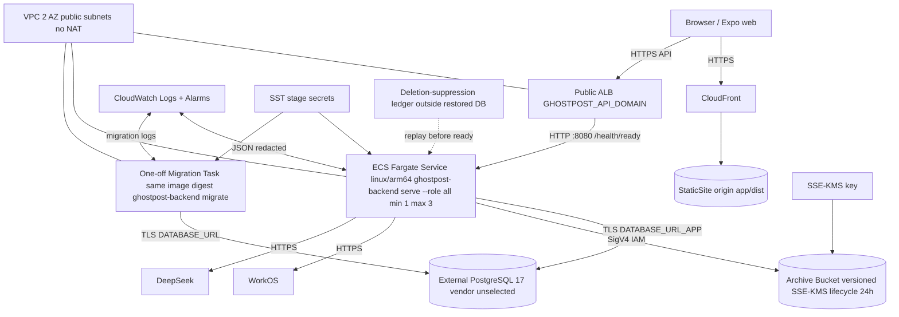
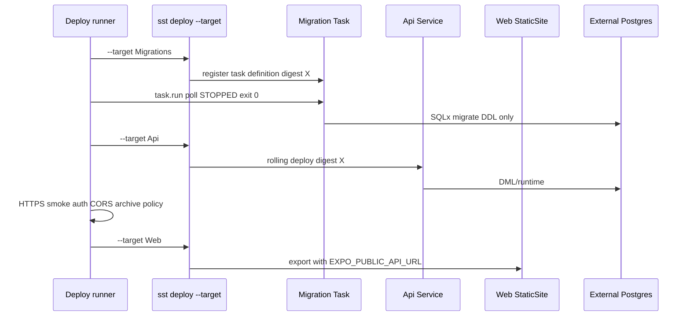

# Plan 009: SST v4 production infrastructure

> **Executor instructions**: Follow this plan step by step. Run every
> verification command and confirm the expected result before moving to the
> next step. If anything in the "STOP conditions" section occurs, stop and
> report — do not improvise. When done, update the status row for this plan
> in `plans/README.md` — unless a reviewer dispatched you and told you they
> maintain the index.
>
> **Drift check (run first)**: `git diff --stat 3625ed1..HEAD -- sst.config.ts package.json package-lock.json backend/Dockerfile backend/.dockerignore docker-compose.yml backend/.env.example scripts/deploy-*.sh scripts/smoke-*.sh infra/ docs/postgres-vendor-gate-checklist.md plans/005-scan-prompt-deepseek-evals.md plans/006-product-apis-entitlements.md plans/007-expo-production-cutover.md plans/008-containerize-local-stack.md`
> If any in-scope file changed since this plan was written, compare the
> "Current state" excerpts against the live code before proceeding; on a
> mismatch, treat it as a STOP condition.

## Status

- **Priority**: P1
- **Effort**: L
- **Risk**: HIGH
- **Depends on**: plans/005-scan-prompt-deepseek-evals.md, plans/006-product-apis-entitlements.md, plans/007-expo-production-cutover.md, plans/008-containerize-local-stack.md
- **Category**: infrastructure
- **Planned at**: commit `3625ed1`, 2026-07-23

## Why this matters

Plans 002–008 land the backend kernel, WorkOS auth, durable presigned archive upload, provider-neutral scan with DeepSeek adapter, product APIs, Expo cutover, and a reproducible local Compose stack. None of that is production-safe until AWS resources exist with the same contracts: private versioned object storage with immutable completion pins, HTTPS-only public ingress, ARM64 Fargate running the identical image digest for migration and API/worker, stage-scoped secrets with a strict DDL/DML environment split, external PostgreSQL injected without vendor lock-in inside SST, CloudWatch observability with redaction, and a **serial** deploy/rollback workflow that never rolls API and schema concurrently. This plan defines SST v4 (`4.17.1`, Ion engine) as the sole production IaC surface. It does **not** implement a Postgres vendor, commit secrets, or choose production domain names — it requires them as gates.

## Current state

Facts at `3625ed1` and after Plans 002–008 have landed:

- Repository root has `app/`, `design/`, `.cursor/` only at baseline; Plan 008 adds `backend/Dockerfile`, `docker-compose.yml`, and local MinIO parity. Plan 009 adds `sst.config.ts`, root npm manifest for SST CLI pinning, deployment runner scripts, and infra test helpers — nothing else.
- `app/package.json`: `export:web` → `expo export --platform web`; output lands in `app/dist/` (`app/app.json` sets `expo.web.output: "static"`).
- `app/src/services/api/index.ts` selects `httpApi` only when `EXPO_PUBLIC_API_URL` is truthy at module init; Plan 007 makes missing URL a release failure.
- Plan 004 archive contract (must exist before deploy):
  - Signed multipart POST policy to private object storage with enforced content-length range; completion HEAD-pins **immutable version ID**.
  - Workers and purge jobs address `(key, versionId)`.
  - Raw lifecycle backstop ≤ 24 hours including noncurrent versions.
- Plan 008 Dockerfile contract reused verbatim:
  - Multi-stage `builder-base` / `builder` / `runtime`; binary `ghostpost-backend`.
  - `serve --role all` default; `migrate` subcommand; non-root UID/GID `10001:10001`; `dumb-init`; `GET /health/live` and `GET /health/ready`.
- Plan 005 DeepSeek contract:
  - Production archive text must not leave the boundary until a **versioned provider-approval manifest** passes CI and worker startup gates.
  - Eval-approved tuple: provider `deepseek`, model `deepseek-v4-flash`, thinking disabled, temperature 0, pinned prompt/schema versions.
- **No** `sst.config.ts`, root `package.json`, ECR push workflow, or AWS resources exist at baseline.

Canonical constraints from the integrated architecture, security, topology, and SST reviews:

| Area | Requirement |
|------|-------------|
| Static web | `sst.aws.StaticSite` builds `app/dist/` via `npm ci && npm run export:web`; `EXPO_PUBLIC_API_URL` set at build time to HTTPS API domain only. |
| Archive bucket | Private S3, Block Public Access, bucket-owner enforced, SSE-KMS, TLS-only bucket policy, versioning enabled, lifecycle ≤24h raw + noncurrent, CORS exact app origin(s), IAM least-privilege presign/worker/delete split. |
| Network | `sst.aws.Vpc` with `nat: false`; Cluster v2 public subnets; ECS SG allows inbound only from ALB. |
| Compute | `sst.aws.Cluster` + one ARM64 `sst.aws.Service` (`role=all`) behind HTTPS ALB; one-off `sst.aws.Task` migrations with **identical image digest**. |
| Postgres | External only via `sst.Secret("DatabaseUrlMigrator")` + `sst.Secret("DatabaseUrlApp")`; no `sst.aws.Postgres`. Deletion-replay ledger outside DB before restored readiness. |
| Secrets split | Migration Task: DDL env only (`DATABASE_URL` migrator role, migration locks/timeouts, logging). API Service: DML/runtime env (`DATABASE_URL_APP`, WorkOS, DeepSeek, archive IAM, CORS, AI config). Never inject WorkOS/DeepSeek into migration Task. |
| Deploy order | Serial: `Migrations` (run task) → `Api` (wait stable) → archive/storage smokes → `Web`. Never concurrent full deploy. |
| Ingress | ALB on `Service.loadBalancer` — not API Gateway (10 MB / 30s hard limits incompatible with archive control plane even though bytes go direct-to-S3). |

## Topology

### Production (staging uses same shape, distinct stage secrets/domains)



### Deploy sequence (every staging/production release)



## Commands you will need

| Purpose | Command | Expected on success |
|---------|---------|---------------------|
| Drift check | `git diff --stat 3625ed1..HEAD -- sst.config.ts package.json backend/Dockerfile` | review only |
| SST CLI pin | `npm ci && npx sst version` | prints `4.17.1` (or pinned version from root lockfile) |
| Config diff | `npx sst diff --stage staging` | no unexpected RDS/NAT/public bucket ACL |
| Target migrations | `npx sst deploy --stage staging --target Migrations` | migration task definition registered |
| Run migration | `npx sst shell --stage staging --target Migrations -- node scripts/run-migration-task.mjs` | exit 0; essential container exitCode 0 |
| Target API | `npx sst deploy --stage staging --target Api` | ECS stable; circuit breaker enabled |
| Health | `curl -fsS "https://${GHOSTPOST_API_DOMAIN}/health/live"` and `/health/ready` | both 200 |
| Target web | `npx sst deploy --stage staging --target Web` | CloudFront URL serves export |
| Bucket policy test | `bash scripts/smoke-archive-bucket.sh --stage staging` | anonymous GET denied; signed POST+HEAD+delete OK; oversize rejected |
| Immutable version test | `bash scripts/smoke-immutable-version.sh --stage staging` | worker addresses pinned versionId |
| DeepSeek gate | `node scripts/validate-deepseek-manifest.mjs --stage staging` | exit 0 when manifest current |
| Postgres gate | `bash scripts/smoke-postgres-gate.sh --stage staging` | TLS, connect, migration perms OK |
| Deletion replay gate | `bash scripts/smoke-deletion-replay.sh --stage staging` | readiness false until ledger replay completes |

Do **not** run project-wide lint/typecheck/test suites as gates for this plan. Focused commands above only.

## Suggested executor toolkit

- AWS account with credentials for deploy role (no long-lived keys in repo).
- Node.js/npm for SST CLI pin at repo root.
- Docker Buildx for `linux/arm64` image verification (Plan 008 image reused).
- `aws` CLI v2 for post-deploy assertions.
- Operator-supplied stage secrets via `sst secret set` (never committed).
- Selected external Postgres connection string and vendor runbook (outside repo).

## Scope

**In scope** (the only files you should create or modify):

- `sst.config.ts` (create at repo root)
- `package.json` + `package-lock.json` (create at repo root — SST CLI pin only)
- `infra/archive-bucket.ts` (create — SST helper for bucket/KMS/policy/lifecycle/CORS/IAM outputs)
- `infra/deepseek-approval.schema.json` (create — JSON Schema for manifest shape)
- `scripts/run-migration-task.mjs` (create — SST Task SDK runner)
- `scripts/validate-deepseek-manifest.mjs` (create — CI/deploy gate)
- `scripts/smoke-archive-bucket.sh` (create — policy/immutability helpers)
- `scripts/smoke-immutable-version.sh` (create)
- `scripts/smoke-postgres-gate.sh` (create — external PG preflight)
- `scripts/smoke-deletion-replay.sh` (create — restore quarantine workflow test harness)
- `scripts/deploy-serial.sh` (create — ordered deploy wrapper)
- `docs/postgres-vendor-gate-checklist.md` (create — operator checklist, no vendor implementation)

**Out of scope** (do NOT touch):

- `backend/src/**` application logic (except if Plan 002–006 env names are missing — then STOP and report).
- `app/**` source (Plan 007 owns cutover).
- `docker-compose.yml`, local MinIO scripts (Plan 008).
- Provisioning RDS/Neon/Supabase/etc. — external Postgres URL only.
- Committing secret values, production domains, or approval manifest with real approver PII.
- Formatters, linters, `cargo test` project-wide, Expo builds outside StaticSite deploy.
- Enabling SST Console autodeploy without the serial runner.

## Git workflow

- Branch: `advisor/009-sst-production-infrastructure`
- Commits (examples):
  - `Add SST v4 config with archive bucket VPC cluster service and static site`
  - `Add serial migration runner and deploy scripts`
  - `Add archive policy immutable-version and postgres deletion-replay smokes`
  - `Add DeepSeek approval manifest schema and gate`
- Do NOT push or open a PR unless the operator instructed it.

## Component inventory and cost floor

| # | SST component | Purpose | Key fields / notes | Approx. monthly floor (us-east-1, low traffic) |
|---|---------------|---------|-------------------|-----------------------------------------------|
| 1 | `sst.Secret` × 11 (+2 incident-only) | Stage secrets | DB DDL/DML URLs; WorkOS API/client/webhook/cookie/session secrets; DeepSeek key + approval JSON; archive and scan HMAC key rings; temporary isolated restore DB URL + guard token only while replay task is enabled | $0 (SST-managed encrypted stage secret storage) |
| 2 | `aws.kms.Key` + alias | Archive SSE-KMS | Rotation enabled; key policy allows bucket + task roles only | ~$1/key |
| 3 | `sst.aws.Bucket` or raw Pulumi bucket | Archive store + deletion-suppression ledger prefix | Versioning ON; BPA ON; owner enforced; SSE-KMS default; TLS-only policy | pennies + requests |
| 4 | Bucket lifecycle | Raw ≤1d; ledger beyond DB restore window | Abort incomplete MPU 1d; raw current/noncurrent ≤1d; ledger retention validated as PITR days + ≥7 | — |
| 5 | Bucket CORS | Web direct upload | `AllowedOrigins: [https://GHOSTPOST_APP_DOMAIN]`; `POST`; no credential headers | — |
| 6 | IAM policy attachments | Task + restore roles | Raw read/write/exact-delete; ledger app put-only; restore list/get; no `s3:*` | — |
| 7 | `sst.aws.Vpc` | Network | `az: 2`, `nat: false` | ~$0.50 hosted zone |
| 8 | `sst.aws.Cluster` | ECS | v2 public subnets | — |
| 9 | `sst.aws.Task` `Migrations` | DDL | Same image as API; `command: ["migrate"]`; on-demand not Spot | ~$0.02/run |
| 10 | `sst.aws.Service` `Api` | API+worker | `architecture: "arm64"`, `cpu: 0.5`, `memory: 1 GB`, ALB HTTPS, autoscaling 1–3 | ~$18 task + ~$16 ALB + ~$4 HTTPS IPv4 |
| 11 | `sst.aws.Task` `DeletionReplay` | Restore suppression | Same image; manual `deletion replay`; isolated restore DB; restore-only S3 permissions; on-demand | only incident runs |
| 12 | `sst.aws.StaticSite` `Web` | Expo static | `build.output: dist`, domain, `EXPO_PUBLIC_API_URL: api.url` | low at small traffic |
| 13 | CloudWatch | Logs/alarms | `/ghostpost/${stage}/api`, `/migrations`, `/deletion-replay`; retention 1mo prod / 2wk staging | usage-based |
| 14 | External Postgres | Data | Injected URL only | vendor-specific (not in SST) |

**Expected AWS infra floor (excluding Postgres, domains, provider API usage): ~$38–45/month production** with one ARM64 task, no NAT, one ALB. Staging with Spot API task adds a second ALB/service floor if not shared.

## Environment-variable matrix (DDL/DML split)

| Variable | Migration Task | API Service | StaticSite build | Source |
|----------|:--------------:|:-----------:|:----------------:|--------|
| `DATABASE_URL` | **required** (migrator/DDL) | — | never | `sst.Secret("DatabaseUrlMigrator")` |
| `DATABASE_APP_ROLE` | **required** DML role identifier for grants | — | never | non-secret stage config |
| `DATABASE_URL_APP` | — | **required** (app/DML) | never | `sst.Secret("DatabaseUrlApp")` |
| `BIND_ADDR` | — | `0.0.0.0:8080` | — | non-secret |
| `RUST_LOG` / `LOG_FORMAT` | optional / `json` | optional / `json` | — | non-secret |
| `MIGRATION_MAX_CONNECTIONS` / `MIGRATION_LOCK_TIMEOUT_SECS` | `2` / `60` | — | — | exact Plan 002 DDL tuning |
| WorkOS auth values | **never** | `WORKOS_API_KEY`, `WORKOS_CLIENT_ID`, `WORKOS_WEBHOOK_SECRET`, `WORKOS_COOKIE_PASSWORD`, `APP_SESSION_KEYS`, exact redirect/origin config | never | five secrets + stage config |
| `DEEPSEEK_API_KEY` | **never** | required | never | secret |
| `SCAN_LLM_PROVIDER` | **never** | `deepseek-v4-flash` | — | non-secret; exact Plan 005 provider ID |
| `SCAN_LLM_APPROVAL_MANIFEST_JSON` | **never** | required | never | stage secret; no container file dependency |
| `SCAN_BATCH_HMAC_KEYS` | **never** | required | never | rotating stage-secret key ring |
| `ARCHIVE_FINGERPRINT_KEYS` | **never** | required | never | rotating stage-secret key ring |
| `ARCHIVE_BUCKET` | — | required | never | linked bucket name output |
| `ARCHIVE_S3_REGION` | — | required | — | provider region |
| `ARCHIVE_S3_FORCE_PATH_STYLE` | — | `false` (AWS) | — | non-secret; omit static S3 credentials |
| Archive IAM | — | task role (no static keys) | — | IAM link |
| `AUTH_WEB_REDIRECT_URI` | — | `https://GHOSTPOST_APP_DOMAIN/auth/callback` | — | exact stage config |
| `AUTH_NATIVE_REDIRECT_URI` | — | `ghostpost://auth/callback` | — | exact stage config |
| `AUTH_WEB_ORIGINS` / `CORS_ALLOWED_ORIGINS` | — | exact app HTTPS origin | — | non-secret |
| `DB_MAX_CONNECTIONS` | — | `10` per replica (max 30 across scaling range) | — | non-secret; vendor gate includes headroom |
| `WORKER_LEASE_SECS` / `WORKER_HEARTBEAT_SECS` / `WORKER_SWEEPER_SECS` | — | required for `role=all` | — | non-secret |
| `EXPO_PUBLIC_API_URL` | — | — | **required** `https://GHOSTPOST_API_DOMAIN` | `api.url` at build |

Rule: if an env var enables **DML**, outbound provider calls, or presigned upload issuance, it must not appear on the Migration Task.

## Steps

### Step 0: Confirm prerequisites from Plans 005–008

```bash
test -f backend/Dockerfile
test -f backend/Cargo.toml
test -f docker-compose.yml
rg -n "health/live|health/ready|serve|--role|migrate" backend/src
rg -n "ARCHIVE_BUCKET|versionId|presign" backend/src
rg -n "DeepseekApproval|deepseek" backend/src || true
```

**Verify**: Plan 008 image builds; Plan 004 version-pinning exists; Plan 005 manifest hook exists or is added in backend as env-gated startup (if missing, STOP — do not deploy without approval gate).

### Step 1: Root SST CLI pin

Create root `package.json`:

```json
{
  "name": "ghostpost-infra",
  "private": true,
  "devDependencies": {
    "sst": "4.17.1"
  }
}
```

Run `npm install` at repo root. Never invoke unversioned `npx sst@latest` in CI.

**Verify**: `npx sst version` matches pinned version.

### Step 2: Implement archive bucket module (`infra/archive-bucket.ts`)

Export a function `createArchiveBucket(scope)` returning `{ bucket, kmsKey, bucketName, kmsKeyArn }`:

1. **KMS key** — `enableKeyRotation: true`; key policy allows account root admin, S3 service via bucket, and ECS task roles (added after Service creation — use `transform` or two-phase if needed).

2. **Bucket** — name pattern `ghostpost-archives-${$app.stage}-${accountId}` (or SST-generated suffix). Settings:
   - `versioning: { enabled: true }`
   - `serverSideEncryptionConfiguration: { rule: { applyServerSideEncryptionByDefault: { sseAlgorithm: aws:kms, kmsMasterKeyId } } }`
   - Public access block: all four true
   - `objectOwnership: BucketOwnerEnforced`
   - `forceDestroy: false` when `$app.stage === "production"`

3. **Bucket policy (TLS-only + deny insecure transport)** — deny `aws:SecureTransport=false` on all `s3:*`; deny public ACL puts.

4. **CORS** — exactly `https://${GHOSTPOST_APP_DOMAIN}` (staging uses staging domain). Method `POST`; allowed header `content-type` only (multipart boundary is browser-generated); expose none; MaxAge 3600. Never allow API Authorization/CSRF headers.

5. **Lifecycle**:
   - Abort incomplete multipart uploads after 1 day.
   - Expire current and noncurrent versions under the exact Plan 004 raw prefix
     after 1 day.
   - Expire current and noncurrent
     `deletion-ledger/v1/` markers only after
     `DELETION_LEDGER_RETENTION_DAYS`; deployment validates this is at least
     `POSTGRES_PITR_RETENTION_DAYS + 7`. Both values are required non-secret
     production config. Never apply the 1-day raw rule bucket-wide.

6. **Access logging** — optional separate logging bucket without object key
content in log fields; if access logs include keys, restrict log bucket policy.

7. **IAM for API task role** (attach to Service):
   - Raw prefix: least-privilege `PutObject`, `GetObject`,
     `GetObjectVersion`, exact-version deletes, and prefix-scoped list required
     by Plan 004.
   - Ledger prefix: `s3:PutObject` only; explicitly deny
     `DeleteObject`/`DeleteObjectVersion` to the application role.
   - Restore operator role: prefix-scoped list/get versions for the ledger;
     no application-runtime trust and no delete.
   - `kms:Encrypt`, `Decrypt`, `GenerateDataKey` only where those operations
     are needed.
   - No `s3:*`, no bucket-wide delete, and no static AWS keys in env.

**Verify** (after deploy): see Step 10 smoke scripts.

### Step 3: Write `sst.config.ts` — app/stage policy

```typescript
/// <reference path="./.sst/platform/config.d.ts" />
export default $config({
  app(input) {
    return {
      name: "ghostpost",
      home: "aws",
      providers: {
        aws: { region: process.env.AWS_REGION! },
      },
      protect: input.stage === "production",
      removal: input.stage === "production" ? "retain" : "remove",
    };
  },
  async run() {
    const appDomain = process.env.GHOSTPOST_APP_DOMAIN;
    const apiDomain = process.env.GHOSTPOST_API_DOMAIN;
    const cookieSite = process.env.GHOSTPOST_COOKIE_SITE;
    const pitrDays = Number(process.env.POSTGRES_PITR_RETENTION_DAYS);
    const ledgerDays = Number(process.env.DELETION_LEDGER_RETENTION_DAYS);
    const appRole = process.env.DATABASE_APP_ROLE;
    if (!appDomain || !apiDomain || !cookieSite) {
      throw new Error("app domain, API domain, and cookie site are required");
    }
    if (!appRole || !/^[a-z_][a-z0-9_]*$/.test(appRole)) {
      throw new Error("DATABASE_APP_ROLE must be a simple unquoted Postgres identifier");
    }
    const isSameSiteDomain = (d: string) =>
      d === cookieSite || d.endsWith(`.${cookieSite}`);
    if (!isSameSiteDomain(appDomain) || !isSameSiteDomain(apiDomain)) {
      throw new Error("web app and API must share GHOSTPOST_COOKIE_SITE for SameSite=Lax auth");
    }
    if (!Number.isInteger(pitrDays) || pitrDays < 1 ||
        !Number.isInteger(ledgerDays) || ledgerDays < pitrDays + 7) {
      throw new Error("ledger retention must be an integer at least PITR retention + 7 days");
    }
    // ... components below; pass ledgerDays to the ledger-prefix lifecycle rule
  },
});
```

Stage strategy:

| Stage | Fargate capacity | protect | removal | log retention | domains |
|-------|------------------|---------|---------|---------------|---------|
| `production` | on-demand | true | retain | 1 month | fixed prod domains |
| `staging` | Spot acceptable | false | remove | 2 weeks | fixed staging domains |

`GHOSTPOST_COOKIE_SITE` is the explicitly reviewed registrable parent (for
example `ghostpost.app`), not a cookie `Domain` attribute. The app/API cookies
remain host-only on the API; this setting only prevents deploying cross-site
custom domains that would break credentialed web exchange with `SameSite=Lax`.

Personal ephemeral cloud stages are **not** created by default (ALB fixed cost + auth safety).

Require `AWS_REGION`, `GHOSTPOST_APP_DOMAIN`, `GHOSTPOST_API_DOMAIN`, and `GIT_SHA` (or `GITHUB_SHA`) in CI for staging/production.

### Step 4: Secrets (no fallback values in production)

```typescript
const databaseUrlMigrator = new sst.Secret("DatabaseUrlMigrator");
const databaseUrlApp = new sst.Secret("DatabaseUrlApp");
const workosApiKey = new sst.Secret("WorkosApiKey");
const workosClientId = new sst.Secret("WorkosClientId");
const workosWebhookSecret = new sst.Secret("WorkosWebhookSecret");
const workosCookiePassword = new sst.Secret("WorkosCookiePassword");
const appSessionKeys = new sst.Secret("AppSessionKeys");
const deepseekApiKey = new sst.Secret("DeepseekApiKey");
const scanApprovalManifestJson = new sst.Secret("ScanLlmApprovalManifestJson");
const archiveFingerprintKeys = new sst.Secret("ArchiveFingerprintKeys");
const scanBatchHmacKeys = new sst.Secret("ScanBatchHmacKeys");
```

Set via CLI before first deploy:

```bash
npx sst secret set DatabaseUrlMigrator "$DATABASE_URL_MIGRATOR" --stage staging
npx sst secret set DatabaseUrlApp "$DATABASE_URL_APP" --stage staging
# ... never echo values in logs
```

**Verify**: `sst diff` shows secrets as references, not literals.

### Step 5: VPC, Cluster, shared image

```typescript
const vpc = new sst.aws.Vpc("Vpc", { az: 2, nat: false });
const cluster = new sst.aws.Cluster("Cluster", { vpc });

const gitSha = process.env.GIT_SHA ?? "local";
const image = {
  context: "./backend",
  dockerfile: "Dockerfile",
  target: "runtime",
  cache: true,
  tags: [gitSha],
};
```

**STOP** if external Postgres requires stable egress IP or private connectivity — `nat: false` cannot satisfy IP allowlists; redesign with NAT/PrivateLink before proceed.

Both `Migrations` Task and `Api` Service must reference the **same** `image` object so SST pushes one digest.

### Step 6: Migration Task (DDL-only)

```typescript
const migrations = new sst.aws.Task("Migrations", {
  cluster,
  architecture: "arm64",
  cpu: "0.25 vCPU",
  memory: "0.5 GB",
  storage: "20 GB",
  image,
  command: ["migrate"],
  environment: {
    DATABASE_URL: databaseUrlMigrator.value,
    DATABASE_APP_ROLE: process.env.DATABASE_APP_ROLE!,
    RUST_LOG: "info",
    LOG_FORMAT: "json",
    MIGRATION_MAX_CONNECTIONS: "2",
    MIGRATION_LOCK_TIMEOUT_SECS: "60",
  },
  logging: {
    name: `/ghostpost/${$app.stage}/migrations`,
    retention: $app.stage === "production" ? "1 month" : "2 weeks",
  },
  // capacity: on-demand (default) — not Spot
});
```

Create `scripts/run-migration-task.mjs`:

```javascript
import { Resource } from "sst";
import { task } from "sst/aws/task";

const run = await task.run(Resource.Migrations);
const arn = run.arn;
for (;;) {
  const d = await task.describe(arn);
  if (d.status === "STOPPED") {
    const code = d.containers?.[0]?.exitCode;
    if (code !== 0) process.exit(code ?? 1);
    break;
  }
  await new Promise((r) => setTimeout(r, 5000));
}
```

**Verify**: task definition image digest matches API after deploy.

### Step 7: API Service (DML/runtime) + ALB + autoscaling + alarms

```typescript
const archive = createArchiveBucket(/* pass vpc/cluster for transforms */);

const api = new sst.aws.Service("Api", {
  cluster,
  architecture: "arm64",
  cpu: "0.5 vCPU",
  memory: "1 GB",
  storage: "20 GB",
  image,
  command: ["serve", "--role", "all"],
  link: [archive.bucket],
  environment: {
    DATABASE_URL_APP: databaseUrlApp.value,
    BIND_ADDR: "0.0.0.0:8080",
    RUST_LOG: "info,sqlx=warn",
    LOG_FORMAT: "json",
    DB_MAX_CONNECTIONS: "10",
    SHUTDOWN_DEADLINE_SECS: "30",
    WORKOS_API_KEY: workosApiKey.value,
    WORKOS_CLIENT_ID: workosClientId.value,
    WORKOS_WEBHOOK_SECRET: workosWebhookSecret.value,
    WORKOS_COOKIE_PASSWORD: workosCookiePassword.value,
    APP_SESSION_KEYS: appSessionKeys.value,
    AUTH_WEB_REDIRECT_URI: `https://${appDomain}/auth/callback`,
    AUTH_NATIVE_REDIRECT_URI: "ghostpost://auth/callback",
    AUTH_WEB_ORIGINS: `https://${appDomain}`,
    CORS_ALLOWED_ORIGINS: `https://${appDomain}`,
    DEEPSEEK_API_KEY: deepseekApiKey.value,
    SCAN_LLM_PROVIDER: "deepseek-v4-flash",
    SCAN_LLM_APPROVAL_MANIFEST_JSON: scanApprovalManifestJson.value,
    SCAN_BATCH_HMAC_KEYS: scanBatchHmacKeys.value,
    ARCHIVE_FINGERPRINT_KEYS: archiveFingerprintKeys.value,
    ARCHIVE_BUCKET: archive.bucketName,
    ARCHIVE_S3_REGION: process.env.AWS_REGION!,
    ARCHIVE_S3_FORCE_PATH_STYLE: "false",
    ARCHIVE_RAW_RETENTION_HOURS: "24",
    WORKER_LEASE_SECS: "60",
    WORKER_HEARTBEAT_SECS: "20",
    WORKER_SWEEPER_SECS: "30",
    RESTORE_REPLAY_PENDING: process.env.RESTORE_REPLAY_PENDING ?? "false",
  },
  loadBalancer: {
    public: true,
    domain: apiDomain,
    rules: [
      { listen: "80/http", redirect: "443/https" },
      { listen: "443/https", forward: "8080/http" },
    ],
    health: {
      "8080/http": {
        path: "/health/ready",
        successCodes: "200",
        interval: "15 seconds",
        timeout: "5 seconds",
        healthyThreshold: 2,
        unhealthyThreshold: 2,
      },
    },
  },
  health: {
    command: ["CMD-SHELL", "curl -fsS http://127.0.0.1:8080/health/live || exit 1"],
    interval: "30 seconds",
    timeout: "5 seconds",
    retries: 3,
    startPeriod: "60 seconds",
  },
  scaling: {
    min: 1,
    max: 3,
    cpuUtilization: 65,
    memoryUtilization: 75,
    scaleOutCooldown: "60 seconds",
    scaleInCooldown: "5 minutes",
  },
  capacity: $app.stage === "production" ? undefined : "spot",
  logging: {
    name: `/ghostpost/${$app.stage}/api`,
    retention: $app.stage === "production" ? "1 month" : "2 weeks",
  },
  wait: true,
  transform: {
    service: (args) => {
      args.deploymentCircuitBreaker = { enable: true, rollback: true };
      args.healthCheckGracePeriodSeconds = 60;
    },
  },
});
```

**CloudWatch alarms** (create via `aws.cloudwatch.MetricAlarm` in same config or transform):

| Alarm | Metric | Threshold | Action |
|-------|--------|-----------|--------|
| `ApiTargetUnhealthy` | `UnHealthyHostCount` (ALB TG) | ≥1 for 2 periods | SNS ops topic |
| `Api5xxRate` | `HTTPCode_Target_5XX_Count` | >10 / 5min | SNS |
| `ApiCpuHigh` | ECS CPUUtilization | >85% 10min | SNS (scale already triggered) |
| `MigrationFailure` | Log metric filter on migration task ERROR | ≥1 | SNS |
| `AccountPurgeStalled` | Log metric filter on structured `event=account_purge_stalled` (local >24h, provider retry SLO, or terminal attempts) | ≥1 | SNS P1 |
| `DeletionReplayFailure` | Restore task nonzero / structured `event=deletion_replay_failed` | ≥1 | SNS P1; readiness stays 503 |

Logs must remain JSON with redaction (no Authorization, cookies, archive names, post text, prompts, completions, DATABASE_URL).

Supply the DeepSeek approval manifest as the `ScanLlmApprovalManifestJson` stage secret; do not bake or mount it in the image and do not set the mutually exclusive local path variable.

**Verify**: `aws ecs describe-services` shows circuit breaker rollback enabled; target group healthy.

### Step 8: StaticSite (Expo web)

```typescript
const web = new sst.aws.StaticSite("Web", {
  path: "./app",
  build: {
    command: "npm ci && npm run export:web",
    output: "dist",
  },
  environment: {
    EXPO_PUBLIC_API_URL: api.url,
  },
  domain: appDomain,
  dev: {
    command: "npm start",
    directory: "./app",
    url: "http://localhost:8081",
    autostart: false,
  },
});
```

Return outputs (no secrets):

```typescript
return {
  apiUrl: api.url,
  webUrl: web.url,
  migrationTaskDefinition: migrations.taskDefinition,
  archiveBucketName: archive.bucketName,
};
```

**Verify**: built bundle contains HTTPS API URL; missing env fails build.

### Step 9: DeepSeek approval manifest gate

Create `infra/deepseek-approval.schema.json` requiring:

- `provider`, `endpoint`, `modelId`
- `termsRevision`, `privacyPolicyRevision`
- `allowedDataClasses[]` (must include `user_authored_archive_text`)
- `retentionDecision`, `trainingUseDecision`, `dataLocation`
- `disclosureVersion`, `consentMechanism`
- `effectiveAt`, `expiresAt`, `approver`, `documentHash`

Use the Plan 005 approval artifact as input, validate it before setting the stage secret, and never commit a production approval instance or approver PII.

`scripts/validate-deepseek-manifest.mjs` checks:

1. JSON Schema valid
2. `expiresAt` > now
3. `provider === deepseek`, `modelId === deepseek-v4-flash`, prompt/schema hashes
   match the Plan 005 release tuple, and required legal/data-handling fields are approved
4. CI fails deploy if missing, expired, wrong model/hash, or unapproved

Backend worker startup (Plan 005) must refuse scan claims when manifest JSON is
invalid. Infrastructure supplies it only through
`SCAN_LLM_APPROVAL_MANIFEST_JSON`.

**Verify**: deploy dry-run fails with exit 1 when manifest expired.

### Step 10: External Postgres vendor gate (no vendor implementation)

Create `docs/postgres-vendor-gate-checklist.md` — operator must confirm before first staging deploy:

- [ ] PostgreSQL 17 compatible
- [ ] TLS required (`sslmode` documented)
- [ ] Reachable from ECS public subnets (or STOP for NAT/peering)
- [ ] Backup + PITR restore tested; actual maximum restorable age recorded as `POSTGRES_PITR_RETENTION_DAYS`
- [ ] Connection limit ≥ `DB_MAX_CONNECTIONS × 3 + migration headroom`
- [ ] Separate migration and app logins exist; `DATABASE_APP_ROLE` is the exact app login identifier; migration role can DDL/grant, app role has DML/sequence access but no CREATE
- [ ] Deletion/export obligations documented
- [ ] Restore drill completed
- [ ] `DELETION_LEDGER_RETENTION_DAYS` is at least the longest backup/PITR restore age plus 7 days

`scripts/smoke-postgres-gate.sh`:

```bash
# Uses DATABASE_URL_MIGRATOR from env for DDL probe — never log URLs
psql "$DATABASE_URL_MIGRATOR" -c 'SELECT version();' >/dev/null
psql "$DATABASE_URL_MIGRATOR" -c 'CREATE TABLE IF NOT EXISTS _ghostpost_gate(id int); DROP TABLE _ghostpost_gate;' >/dev/null
psql "$DATABASE_URL_APP" -c 'SELECT 1;' >/dev/null
psql "$DATABASE_URL_APP" -c 'CREATE TABLE _ghostpost_gate_app(id int)' 2>/dev/null && exit 1 || true
```

### Step 11: Deletion replay before restored readiness

Restoring a pre-deletion DB snapshot can resurrect deleted tenants. Use the
Plan 004 suppression ledger in the private archive bucket; do not create an
unwired second ledger.

Define `DeletionReplay` only when `ENABLE_RESTORE_TASK=true`; normal deploys do
not include it. After restoring an isolated snapshot, the incident runbook
creates a non-migration `ghostpost_restore_guard(token_hash bytea)` table there
with the SHA-256 of a fresh random token and grants SELECT on that table only to
the isolated restore DML login, then sets temporary SST `RestoreDatabaseUrl`
and `RestoreGuardToken` secrets. Reuse the API image with
default command `["deletion", "replay"]`, on-demand capacity, no load balancer,
and a dedicated log group.

Inject only:

- `RESTORE_DATABASE_URL` from `RestoreDatabaseUrl`
- `RESTORE_GUARD_TOKEN` from `RestoreGuardToken`; command hashes and matches the isolated-DB sentinel before mutation
- `RESTORE_REPLAY_PENDING=true`
- `WORKOS_API_KEY` only (no client, webhook, cookie/seal, or session secrets)
- archive bucket/region plus the restore role

The restore task role may list/get only `deletion-ledger/v1/**`, put only
provider-complete companions, get/delete exact `raw/**` versions, and use the
archive KMS key. It gets no broad `s3:*`, migration URL, or serving role.
Create `scripts/run-deletion-replay.mjs --restore-point <RFC3339>` to validate
the timestamp and run the task with the command override; database URLs never
appear in argv, output, or CloudTrail task overrides. After successful proof,
drop the isolated guard table, unset both temporary secrets, set
`ENABLE_RESTORE_TASK=false`, and redeploy to remove the task definition/role.

Implement `scripts/smoke-deletion-replay.sh` and checklist contract:

1. `account.purge` writes
   `deletion-ledger/v1/YYYY/MM/DD/<deleted_at_ms>-<tenant_id>-<user_id>.json`
   before any archive-object or database hard delete. Marker schema is exactly
   `{ schemaVersion, tenantId, userId, deletedAt }`. After WorkOS deletion is
   confirmed, it writes the deterministic sibling
   `<user_id>.provider-complete.json` with `{ schemaVersion, tenantId, userId,
   completedAt }`.
2. Restore a snapshot only to an isolated database, create the post-restore
   guard table/hash, and deploy the restored maintenance target with
   `RESTORE_REPLAY_PENDING=true`; `/health/ready` must remain `503`.
3. Run the backend's restore-replay command in a one-shot task with the isolated
   app DB URL, restore-operator ledger read access, archive exact-version delete
   access, and WorkOS credentials. For every base marker after the snapshot
   restore point, validate schema/key agreement. If the provider-complete
   sibling is absent, recover the WorkOS user ID from the restored minimal/full
   user row, call WorkOS delete (`not_found` is success), then write the
   companion receipt. Only then revoke restored sessions, delete exact archive
   versions, and delete matching `(tenant_id,user_id)` rows through the normal
   purge repository.
4. Prove each marker has a provider-complete receipt and zero readable rows,
   sessions, or archive versions. A marker with no provider-complete receipt
   and no restored user row is a hard failure. Only then redeploy with
   `RESTORE_REPLAY_PENDING=false`.
5. Validate
   `DELETION_LEDGER_RETENTION_DAYS >= POSTGRES_PITR_RETENTION_DAYS + 7`;
   refuse deploy otherwise. The vendor checklist records the actual PITR and
   backup-retention window.

`scripts/smoke-deletion-replay.sh` creates a synthetic tenant plus marker in
staging, runs the replay command against an isolated test database, and asserts
readiness remains `503` until replay exits zero. It must not touch production.

**Verify**: staging simulation exits zero; a missing/malformed marker, failed
object delete, or too-short ledger retention exits non-zero and keeps readiness
blocked.

### Step 12: Serial deploy wrapper

Create `scripts/deploy-serial.sh`:

```bash
#!/usr/bin/env bash
set -euo pipefail
STAGE="${1:?stage}"
export GIT_SHA="${GIT_SHA:-$(git rev-parse HEAD)}"

node scripts/validate-deepseek-manifest.mjs --stage "$STAGE"
bash scripts/smoke-postgres-gate.sh

npx sst deploy --stage "$STAGE" --target Migrations
npx sst shell --stage "$STAGE" --target Migrations -- node scripts/run-migration-task.mjs

npx sst deploy --stage "$STAGE" --target Api
curl -fsS "https://${GHOSTPOST_API_DOMAIN}/health/live"
curl -fsS "https://${GHOSTPOST_API_DOMAIN}/health/ready"

bash scripts/smoke-archive-bucket.sh --stage "$STAGE"
bash scripts/smoke-immutable-version.sh --stage "$STAGE"

curl -s -o /dev/null -w '%{http_code}\n' "https://${GHOSTPOST_API_DOMAIN}/v1/me" | grep 401

npx sst deploy --stage "$STAGE" --target Web
curl -fsI "https://${GHOSTPOST_APP_DOMAIN}/"
```

Never run bare `sst deploy` without targets for staging/production.

**Verify**: script exits non-zero if migration fails before API deploy.

## Policy and immutable-version tests

### `scripts/smoke-archive-bucket.sh`

1. **Anonymous read denied** — unauthenticated GET to object URL → 403
2. **TLS-only** — attempt insecure transport → denied
3. **Task role raw access** — API-issued signed POST succeeds; scoped GET/exact-version DELETE succeeds; a tampered key/field or body over the policy range is denied
4. **Ledger boundary** — task role can create a synthetic ledger marker but cannot delete it; restore role can list/get it but cannot write/delete
5. **CORS preflight** — app origin allowed; alien origin denied
6. **KMS** — uploaded objects and markers use SSE-KMS
7. **Lifecycle** — raw current/noncurrent rules are 1 day; ledger rule equals validated retention and is not matched by the raw rule

### `scripts/smoke-immutable-version.sh`

Integration test against staging API (requires auth token from CI fixture):

1. Reserve import → signed multipart POST creates version A
2. Complete; obtain the pinned version only through a tenant-scoped internal DB
   assertion or worker test hook — the public API must not expose a version ID
3. Reuse the still-valid signed policy to create version B per Plan 004 adversarial test
4. Worker processes **version A only** or fails safe — never B
5. Purge deletes the exact pinned version; lifecycle cleans remaining raw versions

If backend Plan 004 e2e test exists, call it against staging instead of duplicating logic.

## Migration order (every release)

1. Expand-only SQL migrations (Plans 002+ expand/contract discipline)
2. Build/push single ARM64 image for commit SHA
3. `sst deploy --target Migrations` (register task def)
4. Run migration Task; require exit 0 and expected `_sqlx_migrations` version
5. `sst deploy --target Api`; wait ECS stable + ALB healthy + circuit breaker success
6. Archive + auth smokes
7. `sst deploy --target Web` only if API URL or web contract changed (API URL change always requires Web redeploy)

Never deploy Api and Migrations in one untargeted `sst deploy`. Never run migrations inside the long-running Service container.

## Rollback

| Failure | Action |
|---------|--------|
| Migration fails before API | Do **not** deploy Api/Web. Fix forward SQL; rerun migration Task. Never hand-edit `_sqlx_migrations`. |
| API fails readiness | ECS circuit breaker rolls back task definition. Confirm old targets healthy. |
| API regression after deploy | Redeploy previous image digest (`GIT_SHA` tag). API domain unchanged — Web bundle may remain. |
| Web regression | Redeploy prior Web commit; invalidate CloudFront if needed. |
| Bad schema already applied | Forward-fix migration only; no `down` in production. |
| DB restore | Quarantine; replay deletion ledger; keep readiness 503 until verified. |
| Secret leak/rotation | `sst secret set` new value; redeploy Api only (Migrations only if DDL credential rotated). |
| DeepSeek manifest expired | Block deploy at CI; workers must not claim scan jobs. |

## Test plan

- **SST diff review**: no RDS, no NAT (unless explicitly added), no public bucket ACL, secrets not in outputs
- **Image parity**: migration and API task definitions share digest
- **ARM64**: `aws ecs describe-task-definition` → `runtimePlatform.cpuArchitecture = ARM64`
- **Health**: live vs ready semantics; ready does not call WorkOS/DeepSeek
- **Bucket policy suite**: smoke scripts
- **Immutable version suite**: smoke scripts
- **DeepSeek manifest validator**: expired/missing/wrong model fails
- **Postgres gate**: TLS connect + DDL smoke
- **Serial deploy**: migration failure aborts before API
- **Deletion replay doc**: checklist present; readiness gate documented

## Done criteria

Machine-checkable. ALL must hold:

- [ ] `sst.config.ts` defines Vpc (no NAT), Cluster, archive bucket (versioned SSE-KMS BPA TLS lifecycle CORS IAM), Migrations Task, Api Service (ARM64 ALB HTTPS autoscaling circuit breaker), StaticSite
- [ ] Root `package.json` pins SST `4.17.1` (or documented intentional bump)
- [ ] Migration Task env is DDL-only; Api env includes DML/runtime/archive/AI/WorkOS
- [ ] `scripts/deploy-serial.sh` enforces Migrations → run task → Api → smokes → Web
- [ ] `scripts/run-migration-task.mjs` fails on nonzero exit
- [ ] DeepSeek approval schema + validator exist; deploy fails when manifest invalid
- [ ] Postgres vendor gate checklist exists; smoke script validates connectivity without logging URL
- [ ] Deletion replay quarantine documented; readiness blocked until replay complete
- [ ] Archive smokes: anonymous denied, IAM allowed, CORS exact origin, lifecycle rules present
- [ ] Immutable version smoke passes on staging
- [ ] Deletion-ledger app delete is denied; restore-role replay and retention-window checks pass
- [ ] CloudWatch log groups + at least ALB unhealthy + 5xx alarms configured
- [ ] Staging serial deploy completes; production uses same script with `--stage production`
- [ ] No secrets in git, SST outputs, StaticSite env, or task definition literals
- [ ] No files outside in-scope list modified
- [ ] `plans/README.md` status row updated if you own the index

## STOP conditions

Stop and report (do not improvise) if:

- Plans 005–008 artifacts missing or contracts differ (binary name, health paths, version pinning, Dockerfile stages).
- **Postgres vendor/URL not selected** or `DatabaseUrlMigrator` / `DatabaseUrlApp` secrets unset for the stage.
- External Postgres unreachable from ECS, lacks TLS, backup/PITR, or fails `smoke-postgres-gate.sh`.
- Database requires stable egress IP or private-only endpoint but VPC has `nat: false` without peering/PrivateLink design.
- Any required WorkOS/DeepSeek/session secret missing; no placeholder/fallback in production.
- **DeepSeek approval manifest** missing, expired, wrong model/endpoint, or lacks consent/disclosure fields — release STOP (SecurityReview P1).
- Frontend auth transport (Plan 007) not complete and authenticated smokes cannot pass — do not expose production API to users.
- Migration image digest ≠ API image digest.
- Migration Task exits nonzero or is not backward-compatible with currently running API task.
- ARM64 build/manifest/runtime validation fails.
- Bucket lacks any of: versioning, BPA, SSE-KMS, TLS-only policy, raw-prefix lifecycle ≤24h, ledger retention beyond restore window, or exact CORS origin.
- Anonymous List/Get succeeds on archive bucket or task role exceeds least privilege.
- Immutable version test fails (overwrite after complete changes worker input).
- HTTPS custom domain/certificate invalid; never ship plain-HTTP authenticated stage.
- App and API domains do not share the reviewed `GHOSTPOST_COOKIE_SITE`; do not weaken `SameSite=Lax` to make a cross-site deployment work.
- ECS deployment circuit breaker with rollback not enabled.
- `sst deploy` without targets would update Migrations, Api, and Web concurrently.
- Logs, outputs, or bundle contain secrets, archive content, post text, prompts, or completions.
- **Deletion replay**: restored database promoted to serving without ledger reconciliation and readiness gate.
- Operator asks to commit secrets, production passwords, or real approval manifest PII.
- Fix requires editing out-of-scope backend product logic — report gap to Plans 005/006 instead.

## Maintenance notes

- Keep Plan 008 Dockerfile stable; SST only changes `sst.config.ts` and deploy scripts unless image contract evolves.
- Bump SST only deliberately; run `sst refresh` after provider major upgrades per SST v4 docs.
- Bump base image digests in `backend/Dockerfile` separately from SST deploys.
- When splitting API and worker Services, add second Service with `--role worker`, shared image digest, and scale workers independently — still no NAT unless required.
- Reviewers should scrutinize: DDL/DML env split, bucket policy JSON, migration/API digest equality, serial deploy, DeepSeek manifest gate, deletion replay runbook, no Postgres vendor hard-coding.
- Local MinIO parity remains Plan 008; this plan is authoritative for AWS lifecycle/KMS/IAM.
- Deferred beyond this plan: multi-region, WAF, GuardDuty, RDS migration, billing webhooks, Kubernetes.
