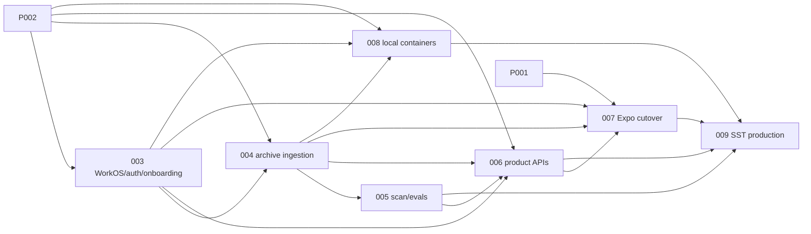

# Ghostpost implementation plans

Dependency-ordered handoff for replacing the Expo mock with an Axum/Postgres
backend, WorkOS authentication, private archive ingestion, model-backed scans,
Docker local infrastructure, and SST production infrastructure. Every plan is
written against commit `3625ed1` on 2026-07-23.

`planned` means the implementation document is ready; it does not claim source
code has landed.

## Execution rules

1. Run the plan's drift check before editing.
2. Execute prerequisites first and use the exact cross-plan contracts below.
3. Run every plan-local verification gate and obey its STOP conditions.
4. Update only that plan's status after its done criteria pass.
5. Do not add compatibility aliases for routes or DTOs removed by the plans.

## Status index

| Plan | Deliverable | Priority | Status | Direct prerequisites |
|------|-------------|----------|--------|----------------------|
| [001](001-recover-typescript-baseline.md) | Green deterministic Expo TypeScript baseline | P1 | **complete** | — |
| [002](002-backend-kernel-schema.md) | Rust/Axum kernel, Postgres schema, durable work queue | P1 | **complete** | — |
| [003](003-workos-auth-profiles-onboarding.md) | WorkOS auth, real profiles, revisioned onboarding | P1 | **complete** | 002 |
| [004](004-archive-upload-ingestion.md) | Private direct upload and Reddit/X normalization | P1 | **complete** | 002, 003 |
| [005](005-scan-prompt-deepseek-evals.md) | `scan-v1`, provider port, DeepSeek adapter, Rust evals | P1 | **complete** | 002, 004 |
| [006](006-product-apis-entitlements.md) | Scan/dashboard/flag APIs and free-beta entitlement | P1 | **complete** | 002, 003, 004, 005 |
| [007](007-expo-production-cutover.md) | Authenticated Expo cutover and complete mock purge | P0 | **planned** | 001, 003, 004, 006 |
| [008](008-containerize-local-stack.md) | Docker local stack: Postgres, MinIO, migrator, backend | P1 | **complete** | 002, 003, 004 |
| [009](009-sst-production-infrastructure.md) | SST v4 AWS production deployment | P1 | **planned** | 005, 006, 007, 008 |

## Dependency graph and landing waves



```text
Wave 1: 001 and 002 in parallel
Wave 2: 003
Wave 3: 004
Wave 4: 005 and 008 in parallel
Wave 5: 006
Wave 6: 007
Wave 7: 009
```

## Frozen cross-plan contracts

- **Auth entry**: `GET /v1/auth/authorize?client=web|native` always returns
  JSON. The backend chooses an exact frontend callback URI and holds the S256
  PKCE verifier. Web exchange proof is the HttpOnly `gp_auth_init` cookie;
  native proof is a separate server-issued one-time `exchangeSecret`.
- **Auth completion**: the frontend callback sends `client`, `code`, `state`,
  and native `exchangeSecret` to `POST /v1/auth/exchange`. Web success is
  `204` plus `gp_session`; native success is
  `{ user, session: { kind: "bearer", token, expiresAt } }`. Expo never sees
  WorkOS tokens. No backend callback route exists.
- **Identity tenancy**: v1 provisions one personal tenant per globally unique
  WorkOS user. Tombstoned users cannot be recreated while `account.purge` is
  pending.
- **Profile/lifecycle**: `GET /v1/me` returns the user profile only. There is no
  `/v1/lifecycle` endpoint and no embedded lifecycle field. Expo derives its
  gate from onboarding, owned imports, scans, and entitlement reads.
- **Onboarding/catalog**: `GET|PUT /v1/me/onboarding` uses the full revisioned
  `{ status, currentStep, revision, answers }` snapshot. `GET /v1/platforms`
  exposes Reddit/X as archive-enabled and Facebook/Instagram/TikTok as disabled
  `Coming soon`.
- **Archive upload**: reserve with `{ platform, contentLength, contentType }`;
  receive `{ id, upload: { method: "POST", url, fields }, expiresAt }`; append
  signed fields plus the native `ExpoFile` or browser `File` to `FormData` and
  POST directly. The policy enforces a content-length range; the server
  HEAD-verifies and pins an immutable object version. No client SHA,
  base64 upload, public bucket, live social API, or ingestion-triggered model
  call.
- **Normalization**: only allowlisted Reddit/X export records become private
  normalized rows. The normalizer assigns export-native `kind` and
  `authorship=authored|amplified`; likes, votes, DMs, media, and profile data
  remain excluded.
- **Model boundary**: provider input is `scan-input.v1` with sorted
  `comingUp`, `concerns`, and batch-local items containing only `itemIndex`,
  `platform`, `kind`, `authorship`, and minimized `text`. Output is one
  `scan-output.v1` result per item; no source IDs, counts, or summary object.
- **Provider/privacy**: DeepSeek V4 Flash is behind a provider-neutral Rust
  trait and a deny-by-default approval manifest. No raw prompt, no raw model
  response, and no no-flag text is retained in model-attempt telemetry.
- **Product**: `POST /v1/scans` requires the exact chosen ready
  `archiveImportIds`. Poll by returned scan ID until `succeeded`, `failed`, or
  `cancelled`; only success enters review. `free_beta` is issued server-side;
  no client unlock/grant/demo/billing route exists.
- **Mutation identity**: clients generate UUIDv4 idempotency keys per confirmed
  operation and preserve the same key across network/auth/CSRF retries of the
  exact method/body; they never mint a key inside retry logic.
- **Work ownership**: every user-triggered `work_items` row sets
  `subject_user_id`; account deletion cancels that user's non-purge work and
  uses one deduplicated, checkpointed `account.purge` item.
- **Frontend**: production source has no mock fallback, AsyncStorage gate,
  priced lock screen, base64 archive path, or guessed legacy route. Query data
  is isolated by session generation and user ID.
- **Infrastructure**: local Docker owns Postgres/MinIO/migrations and the same
  ARM64 backend image later deployed by SST to ECS/Fargate. Migration and app
  DB roles are separate; migration uses a two-connection pool plus a timed
  advisory lock and grants DML to `DATABASE_APP_ROLE`. Production archive
  storage is private, versioned, encrypted, lifecycle-limited, and never served
  by the API container filesystem.
- **Deletion recovery**: account purge writes a minimal encrypted suppression
  marker before object/database deletion and a provider-complete companion
  after WorkOS deletion. Local content/PII purge does not wait on provider
  recovery; only `{ tenant_id, id, workos_user_id, deleted_at }` remains as a
  retry/login-blocking tombstone until provider success. Production ledger
  retention exceeds the external Postgres restore window; restored databases
  remain unready until every later marker has provider and local postconditions
  replayed by the isolated one-shot task.
- **Build topology**: `backend/` remains a self-contained Cargo workspace for
  its binary plus `scan-text`; `evals/` is a separate crate. The backend Docker
  context never depends on a repo-root Cargo workspace.

## Drift baseline

Every executor starts with
`git diff --stat 3625ed1..HEAD -- <plan-specific paths>`, then reconciles live
code against the plan's current-state evidence before editing.
